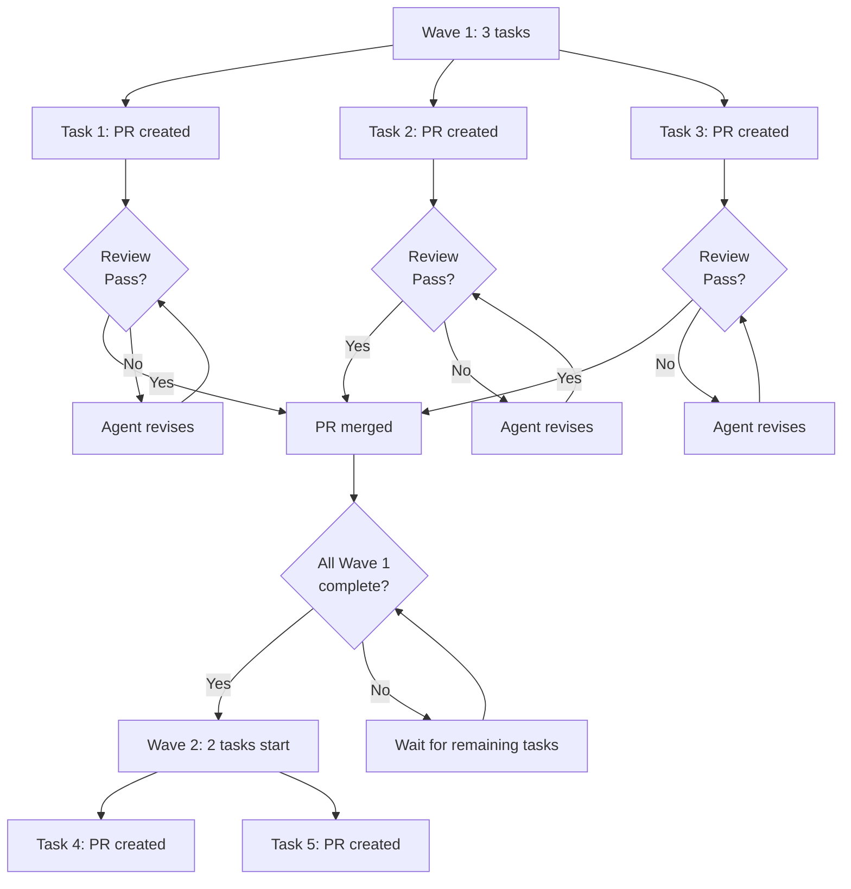
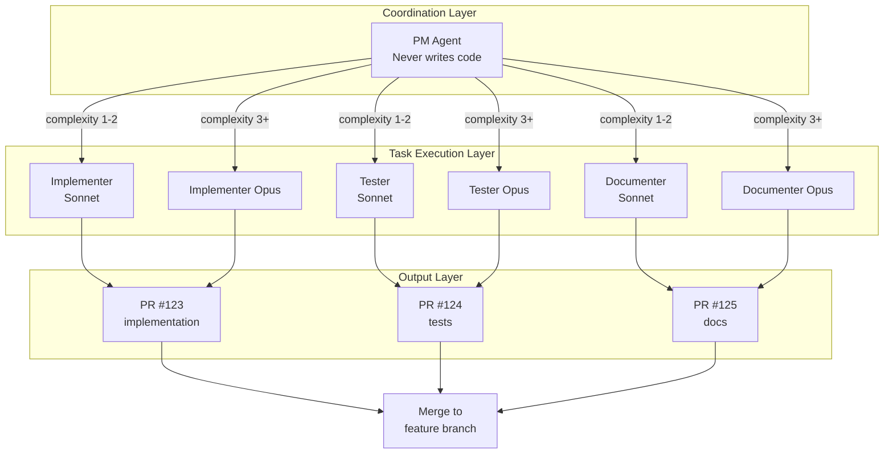

# KARIMO Architecture

**Version:** 7.19.0
**Status:** Active

---

## Overview

KARIMO is an autonomous development **methodology** delivered via Claude Code configuration. It transforms product requirements into shipped code using AI agents, GitHub automation, and structured human oversight — all through slash commands.

**Core philosophy:** You are the architect, agents are the builders, Greptile is the inspector.

### Design Principles

**Single-PRD scope.** KARIMO operates within one PRD at a time. Each PRD maps to one feature branch. Cross-feature dependencies are the human architect's responsibility — you sequence PRDs so that dependent features execute only after their prerequisites are merged to main. This is intentional: the goal isn't to produce a hundred features simultaneously, it's to let agents autonomously execute a few features at a time while building trust between you, the codebase, and the agents.

**Sequential feature execution.** If Feature 8 depends on Feature 3, you finish Feature 3's PRD cycle (plan → execute → review → merge to main) before starting Feature 8. You may run Features 1, 2, and 3 in parallel if they're independent, but Feature 8 waits. This matches how product teams actually ship.

---

## Manifest System

KARIMO uses `.karimo/MANIFEST.json` as the single source of truth for installed files. This enables:

- **Consistent installation**: `install.sh` reads from manifest, not hardcoded lists
- **Version tracking**: Manifest includes version number for update detection
- **Clean updates**: Update script uses manifest to detect and remove stale files
- **Easy maintenance**: Adding new files requires only updating MANIFEST.json

### Manifest Structure

```json
{
  "version": "7.3.0",
  "agents": ["karimo-brief-writer.md", "karimo-pm.md", ...],
  "commands": ["karimo-configure.md", "karimo-run.md", ...],
  "skills": ["karimo-code-standards.md", ...],
  "templates": ["PRD_TEMPLATE.md", "TASK_SCHEMA.md", ...],
  "other": {
    "rules": "KARIMO_RULES.md",
    "issue_template": "karimo-task.yml"
  }
}
```

> **Note:** KARIMO installs zero workflows by default. Greptile integration is available via `/karimo:configure --greptile`.

---

## What KARIMO Is

KARIMO is a **configuration framework**, not a compiled application:

- **Agents**: Markdown files defining specialized agent roles
- **Commands**: Slash command definitions for Claude Code
- **Skills**: Reusable capabilities agents can invoke
- **Templates**: PRD, task, and status schemas
- **Manifest**: JSON file tracking all components

Everything is installed into your project via `install.sh` — no binaries, no build step, no workflows by default.

---

## Recent Enhancements

### v7.7.0: Enhanced Traceability & Transparency

**Incremental PRD Commits**

The interview agent (`karimo-interviewer`) now commits PRD sections progressively during `/karimo:plan`:
- **Round 1:** Executive summary → commit with message `docs(karimo): add PRD framing for {slug}`
- **Round 2:** Requirements → commit with message `docs(karimo): add PRD requirements for {slug}`
- **Round 3:** Dependencies → commit with message `docs(karimo): add PRD dependencies for {slug}`
- **Round 4:** Complete PRD → commit with message `docs(karimo): complete PRD for {slug}`

**Implementation:**
- Agent tools: Added `Bash` and `Write` to `karimo-interviewer.md` agent definition
- Protocol: Commit instructions added to `.karimo/templates/INTERVIEW_PROTOCOL.md` after each round
- Format: All commits follow conventional commits with `Co-Authored-By: Claude Sonnet 4.5 <noreply@anthropic.com>` footer

**Benefits:**
- Git-based crash recovery if interview interrupted
- Audit trail showing interview progression
- Consistency with research and task brief commit patterns
- No leftover uncommitted markdown artifacts

**Enhanced Merge Reports**

The `/karimo:merge` command generates PR descriptions with markdown/code breakdown:
- Separates documentation files (`.md`, `.mdx`) from production code
- Shows file counts and line additions/deletions for each category
- Provides transparency in PR scope and complexity assessment

**Implementation:**
- Statistics calculation: Bash code in `.claude/plugins/karimo/commands/merge.md` (lines 105-128)
- PR body template: Enhanced template includes breakdown section (lines 386-388)
- Git diff parsing: Uses `git diff --numstat` with grep filtering for markdown detection

**Example Output:**
```
**Total:**
- Files changed: 49 files
- Additions: +8544 lines
- Deletions: -512 lines

**Breakdown:**
- Docs: 12 files (4 new), +3200/-50 lines
- Code: 37 files, +5344/-462 lines
```

---

## Context Architecture

KARIMO uses layered context management inspired by the [OpenViking Protocol](https://github.com/volcengine/OpenViking) for efficient token usage and quick context scanning.

### Three-Layer System

| Layer | Size | Query Order | Purpose | Files |
|-------|------|-------------|---------|-------|
| **L0 Abstracts** | ~100 tokens | 2nd | Single-item verification | `*.abstract.md` |
| **L1 Overviews** | ~2K tokens | 1st | Discover all items | `*.overview.md` |
| **L2 Full Definitions** | Variable | 3rd | Complete content for execution | `*.md` (full files) |

> **Note:** "L" = Level of Detail (L0 = minimal, L2 = full), not query order. Query L1 first to discover, L0 to verify, L2 to execute.

### Agent & Skill Abstracts

Each agent and skill has a compact abstract for quick context loading:

```
.claude/
├── agents/
│   ├── karimo-pm.md              # L2: Full definition (830 lines)
│   ├── karimo-pm.abstract.md     # L0: Quick summary (~100 tokens)
│   └── ...
├── skills/
│   ├── karimo-code-standards.md         # L2: Full definition
│   ├── karimo-code-standards.abstract.md # L0: Quick summary
│   └── ...
├── agents.overview.md             # L1: All agents at a glance
└── skills.overview.md             # L1: All skills at a glance
```

**Abstract Template (~100 tokens):**
```markdown
# {Component Name}

**Type:** Agent | Skill
**Model:** sonnet | opus
**Trigger:** {When this activates}
**Purpose:** {One sentence from description}

## Key Capabilities
- {Capability 1}
- {Capability 2}
- {Capability 3}

## Tools
{Comma-separated list}

---
*Full definition: `.claude/agents/{name}.md` ({N} lines)*
```

### Brief Abstracts

Task briefs also use the L0/L1/L2 pattern:

```
.karimo/prds/{slug}/briefs/
├── 1a_{slug}.md              # L2: Full brief
├── 1a_{slug}.abstract.md     # L0: Abstract (~50 tokens)
├── briefs.overview.md        # L1: All briefs summary
└── ...
```

### Categorized Learnings

Learnings are organized by category for efficient retrieval:

```
.karimo/learnings/
├── index.md              # Master overview + navigation
├── TEMPLATE.md           # Template for new entries
├── patterns/             # Positive practices
├── anti-patterns/        # Mistakes to avoid
├── project-notes/        # Project-specific context
└── execution-rules/      # Mandatory guidelines
```

### Cross-PRD Findings

Patterns discovered during execution are indexed for reuse:

```
.karimo/findings/
├── index.md              # Cross-PRD patterns overview
├── PROMOTION_GUIDE.md    # How patterns get promoted
├── by-prd/               # PRD-specific findings
└── by-pattern/           # Pattern-based index
```

**Benefits:**
- Reduced context loading (read L0 first, L2 only when needed)
- Quick agent/skill discovery via overview tables
- Efficient pattern reuse across PRDs
- Categorized learnings for targeted retrieval

For projects wanting vector-enhanced search, see [EMBEDDINGS-OPTIONAL.md](EMBEDDINGS-OPTIONAL.md) for implementation guidance and the [OpenViking repository](https://github.com/volcengine/OpenViking) for protocol specification.

---

## Installation Architecture

### What Gets Installed

When you run `bash KARIMO/.karimo/install.sh /path/to/project`, files are copied based on `.karimo/MANIFEST.json`:

```
Target Project/
├── .claude/
│   ├── agents/                      # 22 agents from manifest
│   │   ├── karimo-interviewer.md    # PRD interview conductor
│   │   ├── karimo-investigator.md   # Codebase pattern scanner
│   │   ├── karimo-researcher.md     # Research conductor (internal + external)
│   │   ├── karimo-refiner.md        # Annotation processor
│   │   ├── karimo-reviewer.md       # PRD validation and DAG generation
│   │   ├── karimo-brief-writer.md   # Task brief generator
│   │   ├── karimo-brief-reviewer.md # Pre-execution validation
│   │   ├── karimo-brief-corrector.md # Brief correction agent
│   │   ├── karimo-pm.md             # Task coordination (orchestrator, never writes code)
│   │   ├── karimo-pm-reviewer.md    # Review coordination agent
│   │   ├── karimo-pm-finalizer.md   # Cleanup and finalization agent
│   │   ├── karimo-review-architect.md # Code-level integration
│   │   ├── karimo-greptile-remediator.md # Batch fixes Greptile findings (v7.13)
│   │   ├── karimo-feedback-auditor.md # Feedback investigation agent
│   │   ├── karimo-coverage-reviewer.md # Coverage analysis for PRs
│   │   ├── karimo-implementer.md    # Task agent: coding (Sonnet)
│   │   ├── karimo-implementer-opus.md # Task agent: coding (Opus)
│   │   ├── karimo-tester.md         # Task agent: tests (Sonnet)
│   │   ├── karimo-tester-opus.md    # Task agent: tests (Opus)
│   │   ├── karimo-documenter.md     # Task agent: docs (Sonnet)
│   │   └── karimo-documenter-opus.md # Task agent: docs (Opus)
│   ├── commands/                    # 11 commands from manifest
│   │   ├── karimo-configure.md      # /karimo:configure
│   │   ├── karimo-dashboard.md      # /karimo:dashboard (includes status)
│   │   ├── karimo-doctor.md         # /karimo:doctor (includes --test)
│   │   ├── karimo-feedback.md       # /karimo:feedback (unified with complexity detection)
│   │   ├── karimo-greptile-review.md # /karimo:greptile-review (standalone Greptile loop, v7.13)
│   │   ├── karimo-help.md           # /karimo:help
│   │   ├── karimo-merge.md          # /karimo:merge (final PR to main)
│   │   ├── karimo-plan.md           # /karimo:plan (with interactive review)
│   │   ├── karimo-research.md       # /karimo:research (required first step)
│   │   ├── karimo-run.md            # /karimo:run (brief gen + execution)
│   │   └── karimo-update.md         # /karimo:update
│   ├── skills/                      # 7 skills from manifest
│   │   ├── karimo-bash-utilities.md       # Bash utilities + asset CLI docs
│   │   ├── karimo-research-methods.md     # Research methodology
│   │   ├── karimo-external-research.md    # External research patterns
│   │   ├── karimo-firecrawl-web-tools.md  # Firecrawl MCP reference
│   │   ├── karimo-code-standards.md       # Task agent skill
│   │   ├── karimo-testing-standards.md    # Task agent skill
│   │   └── karimo-doc-standards.md        # Task agent skill
│   └── KARIMO_RULES.md              # Agent behavior rules
│
├── .karimo/
│   ├── MANIFEST.json                # Single source of truth
│   ├── VERSION                      # Version tracking
│   ├── templates/                   # 18 templates from manifest
│   │   ├── PRD_TEMPLATE.md
│   │   ├── INTERVIEW_PROTOCOL.md
│   │   ├── TASK_SCHEMA.md
│   │   ├── STATUS_SCHEMA.md
│   │   ├── DEPENDENCIES_TEMPLATE.md
│   │   ├── EXECUTION_PLAN_SCHEMA.md
│   │   ├── FEEDBACK_INTERVIEW_PROTOCOL.md   # Adaptive feedback interviews
│   │   └── FEEDBACK_DOCUMENT_TEMPLATE.md    # Feedback investigation artifacts
│   ├── prds/                        # Created PRDs stored here
│   ├── feedback/                    # Feedback investigation documents (complex path)
│   ├── learnings/                   # Categorized learnings (patterns, anti-patterns, etc.)
│   └── findings/                    # Cross-PRD pattern index
│
├── .github/
│   └── ISSUE_TEMPLATE/
│       └── karimo-task.yml              # Task issue template
│
├── CLAUDE.md                        # Modified with minimal reference block (~8 lines)
└── .gitignore                       # Updated with .worktrees/
```

**CI Mode:** For non-interactive installation (CI/CD pipelines), use the `--ci` flag:
```bash
bash KARIMO/.karimo/install.sh --ci /path/to/project
```

### How CLAUDE.md is Modified

KARIMO follows Anthropic's best practice of keeping CLAUDE.md minimal. `install.sh` uses a **modular approach**:

1. **Copies** `KARIMO_RULES.md` to `.claude/plugins/karimo/KARIMO_RULES.md` (agent behavior rules)
2. **Creates** `.karimo/config.yaml` (project configuration — filled by `/karimo:configure`)
3. **Creates** `.karimo/learnings/` directory (categorized learnings — filled by `/karimo:feedback`)
4. **Creates** `.karimo/findings/` directory (cross-PRD patterns — populated during execution)
5. **Appends** a minimal reference block (~8 lines) to `CLAUDE.md`:

```markdown
---

## KARIMO

This project uses [KARIMO](https://github.com/opensesh/KARIMO) for PRD-driven autonomous development.

- **Agent rules:** `.claude/plugins/karimo/KARIMO_RULES.md`
- **Config & PRDs:** `.karimo/`
- **Learnings:** `.karimo/learnings/`
- **All commands prefixed** `karimo:` — type `/karimo-` to see available commands
```

### Conflict Handling

If the user already has a `## KARIMO` section in their `CLAUDE.md`, `install.sh` skips the append to avoid duplicates.

---

## Lifecycle Hooks

KARIMO supports optional lifecycle hooks that execute custom scripts at key points during task execution. Hooks enable integration with external systems (Slack, Jira, PagerDuty), custom validation, deployment triggers, and monitoring.

### Hook System Architecture

**Location:** `.karimo/hooks/`

**Hook Types:**

| Hook | Trigger Point | Purpose |
|------|--------------|---------|
| `pre-wave.sh` | Before wave starts | Reserve resources, notify team, prepare infrastructure |
| `pre-task.sh` | Before spawning task agent | Send notifications, create tracking tickets, validate preconditions |
| `post-task.sh` | After PR created | Update project management tools, trigger deployments, send completion alerts |
| `post-wave.sh` | After wave completes | Clean up resources, send batch reports, trigger CI/CD |
| `on-failure.sh` | When task fails or needs revision | Alert on-call engineers, create incidents, log failures |
| `on-merge.sh` | After PR merges to target branch | Trigger production deployments, update changelogs, notify stakeholders |

**Hook Interface:**

Hooks receive context via environment variables:

```bash
# Task context (all hooks)
export TASK_ID="{task_id}"
export PRD_SLUG="{prd_slug}"
export TASK_NAME="{task_name}"
export TASK_TYPE="{task_type}"  # implementation, testing, documentation
export COMPLEXITY="{complexity}"
export WAVE="{wave}"
export BRANCH_NAME="worktree/{prd-slug}-{task-id}"
export PROJECT_ROOT="$(pwd)"
export KARIMO_VERSION="$(cat .karimo/VERSION)"

# PR context (post-task, on-merge, on-failure)
export PR_NUMBER="{pr_number}"
export PR_URL="{pr_url}"

# Failure context (on-failure only)
export FAILURE_REASON="{error_message}"
export ATTEMPT="{loop_count}"
export MAX_ATTEMPTS="3"
export ESCALATED_MODEL="{model}"

# Merge context (on-merge only)
export MERGE_SHA="{merge_commit_sha}"
```

**Exit Codes:**

| Code | Meaning | Effect |
|------|---------|--------|
| `0` | Success | Continue execution |
| `1` | Soft failure | Log warning, continue execution |
| `2` | Hard failure | Abort current task/wave |

**Hook Execution Flow:**

```
Wave Start
  │
  └─► pre-wave.sh (exit 2 aborts wave)
       │
       └─► For each task in wave:
            │
            ├─► pre-task.sh (exit 2 skips task)
            │    │
            │    └─► Task agent executes
            │         │
            │         └─► PR created
            │              │
            │              └─► post-task.sh (failures logged)
            │                   │
            │                   └─► Review cycle
            │                        │
            │                        ├─► (if fails) on-failure.sh
            │                        │
            │                        └─► (if merges) on-merge.sh
            │
            └─► After all tasks merge:
                 │
                 └─► post-wave.sh
```

**Creating Hooks:**

1. Copy example hook:
   ```bash
   cp .karimo/hooks/pre-task.example.sh .karimo/hooks/pre-task.sh
   ```

2. Make executable:
   ```bash
   chmod +x .karimo/hooks/pre-task.sh
   ```

3. Customize logic:
   ```bash
   #!/bin/bash
   # Send Slack notification
   curl -X POST $SLACK_WEBHOOK \
     -d "{\"text\": \"Task started: $TASK_NAME\"}"
   exit 0
   ```

**Multi-Language Hooks:**

Hooks can be written in any language. The filename must end in `.sh` and be executable:

```bash
# Python hook
#!/usr/bin/env python3
import os, requests
webhook = os.getenv('SLACK_WEBHOOK_URL')
# ... logic ...

# Node.js hook
#!/usr/bin/env node
const webhook = process.env.SLACK_WEBHOOK_URL;
// ... logic ...

# Make executable and symlink
chmod +x pre-task.py
ln -s pre-task.py pre-task.sh
```

**Disabling Hooks:**

```bash
# Remove execute permission
chmod -x .karimo/hooks/pre-task.sh

# Or rename
mv .karimo/hooks/pre-task.sh .karimo/hooks/pre-task.sh.disabled
```

**Security:**

- Never commit secrets to hook files
- Use environment variables for sensitive data
- Validate external inputs
- Test hooks independently before PRD execution

**Documentation:** See `.karimo/hooks/README.md` for comprehensive examples including Slack, Jira, PagerDuty, and deployment integrations.

---

## System Flow

```
┌──────────────────────┐    ┌─────────────────────────────────────────┐    ┌─────────────────────────────────────────┐    ┌────────────┐    ┌─────────────┐    ┌───────────┐
│   /karimo:research   │    │            /karimo:plan                 │    │           /karimo:run                   │    │   Review   │    │ Reconcile   │    │   Merge   │
│  (required first)    │ →  │  Interview → PRD → Review → Approve     │ →  │  Brief Gen → Agent Execution → PRs     │ →  │ (Greptile) │ →  │ (Architect) │ →  │   (PR)    │
│  Pattern Discovery   │    │                                         │    │                                         │    │            │    │             │    │           │
└──────────────────────┘    └─────────────────────────────────────────┘    └─────────────────────────────────────────┘    └────────────┘    └─────────────┘    └───────────┘
```

### Two-Tier Merge Model

KARIMO uses a two-tier merge strategy:

```
Task PRs (automated)              Feature PR (human gate)
─────────────────────             ──────────────────────

task-branch-1a ─┐
                ├──► feature/{prd-slug} ──► main
task-branch-1b ─┘         ▲                  ▲
                          │                  │
              Review/Architect          Human Review
              validates integration     final approval
```

**Tier 1: Task → Feature Branch (Automated)**
- Task agents create PRs targeting `feature/{prd-slug}`
- Greptile reviews each task PR
- Review/Architect validates integration
- PRs merge automatically after validation passes

**Tier 2: Feature → Main (Human Gate)**
- Review/Architect prepares feature PR to `main`
- Full reconciliation checklist completed
- Human reviews and approves final merge
- This is the single human approval gate per feature

### Interview Phase (`/karimo:plan`)

1. **Intake**: User provides initial context
2. **Investigator**: Scans codebase for patterns
3. **Conversational**: 5-round structured interview
4. **Reviewer**: Validates and generates task DAG
5. **Interactive Review**: User approves, modifies, or saves as draft

**Output**: `.karimo/prds/{slug}/` containing:
- `PRD_{slug}.md` — Full PRD document (slug-based naming for searchability)
- `tasks.yaml` — Task definitions
- `execution_plan.yaml` — Wave-based execution plan
- `status.json` — Execution tracking (status: `ready` when approved)
- `findings.md` — Cross-task discoveries (populated during execution)

### Research Phase (`/karimo:research`)

Research is the required first step in v7.0. Run `/karimo:research "feature-name"` to create the PRD folder and run research before `/karimo:plan`.

**Two Research Modes:**

1. **General Research** (not tied to PRD):
   ```bash
   /karimo:research "topic to research"
   ```
   - Interactive questions about research focus
   - Internal codebase research (if relevant)
   - External web search and documentation
   - Saves to `.karimo/research/{topic}-{NNN}.md`
   - Updates catalog: `.karimo/research/index.yaml`
   - Available for import into future PRDs

2. **PRD-Scoped Research** (enhances specific PRD):
   ```bash
   /karimo:research --prd {slug}
   ```
   - Loads PRD context
   - Offers import from general research
   - Interactive research focus questions
   - Internal research (patterns, errors, dependencies, structure)
   - External research (best practices, libraries, references)
   - Enhances PRD with `## Research Findings` section
   - Saves evidence to `.karimo/prds/{slug}/research/`

**Research Folder Structure (PRD-Scoped):**
```
.karimo/prds/{slug}/research/
├── imported/           # Imported from .karimo/research/
├── internal/           # Codebase patterns, errors, dependencies
├── external/           # Web research, libraries, best practices
├── annotations/        # Refinement tracking (if refined)
└── meta.json          # Research metadata
```

**PRD Enhancement:**
After research, `PRD_{slug}.md` is enhanced with:
```markdown
## Research Findings

### Implementation Context
- Existing patterns (file:line references)
- Best practices from external sources
- Recommended libraries with rationale
- Critical issues identified
- Architectural decisions

### Task-Specific Research Notes
- Per-task implementation guidance
- Patterns to follow
- Known issues to address
- Dependencies (file and library)
```

**Refinement Workflow:**
Add inline annotations to research artifacts:
```html
<!-- ANNOTATION
type: question|correction|addition|challenge|decision
text: "feedback text"
-->
```

Then refine:
```bash
/karimo:research --refine --prd {slug}
```

Refiner agent processes annotations, updates research, re-enhances PRD.

**Integration with Execution:**
- Brief-writer inherits research from PRD's `## Research Findings` section
- Task briefs include `## Research Context` with task-specific guidance
- Worker agents receive patterns, issues, libraries, dependencies
- Reduces brief validation failures by 40%+ (target: 40% → <20%)

**Benefits:**
- Pattern discovery (find existing implementations)
- Gap identification (detect missing components)
- Library recommendations (evaluated, not guessed)
- Knowledge accumulation (build reusable pattern library)
- Reduced execution errors (research-informed briefs)

### Execution Phase (`/karimo:run`)

**Phase 1: Brief Generation**
1. Brief Writer generates self-contained briefs per task
2. Briefs committed to git atomically: `.karimo/prds/{slug}/briefs/`

**Phase 1.5: Pre-Execution Review Gate (v5.1)**

Two-stage optional validation before execution begins:

**Stage 1: Investigation**
1. User chooses: Review briefs (recommended) | Skip review | Cancel
2. If review chosen: Brief Reviewer agent spawns
3. Agent validates briefs against codebase reality:
   - Assumption validation (current file states)
   - Success criteria feasibility (cross-task contradictions)
   - Configuration prerequisites (vitest projects, ESLint rules, etc.)
   - File structure validation (paths, imports)
   - Dependency state (wave ordering vs file overlaps)
   - Version consistency (with existing patterns)
4. Produces findings document: `.karimo/prds/{slug}/review/PRD_REVIEW_pre-orchestration.md`
5. Findings committed to git atomically

**Stage 2: Correction (Conditional)**
1. User chooses: Apply corrections (recommended) | Skip corrections | Cancel
2. If apply chosen: Brief Corrector agent spawns
3. Agent reads findings document and applies fixes:
   - Modifies task briefs (success criteria, context notes, file paths)
   - Updates PRD (clarifies requirements, adds constraints)
   - Creates new task briefs (if findings reveal missing work)
   - Updates tasks.yaml (if task structure changes)
4. Corrections committed to git atomically

**Benefits:**
- Catches incorrect assumptions before execution (saves tokens/time)
- Prevents contradictory success criteria
- Validates configuration prerequisites exist
- Significantly increases execution success rate
- Reduces automated review failures (Greptile/Code Review)

**Flags:**
- `--skip-review`: Skip Phase 1.5 entirely, execute immediately
- `--review-only`: Run Phase 1.5 then stop (no Phase 2 execution)

**Phase 2: Task Execution**

1. PM Agent reads `execution_plan.yaml` for wave-based scheduling
2. PM Agent reads pre-generated (and corrected) briefs from `.karimo/prds/{slug}/briefs/`
3. Creates worktrees at `.worktrees/{prd-slug}/{task-id}`
4. Spawns agents for ready tasks (respects `max_parallel`)
5. Propagates findings between dependent tasks
6. Creates PRs when tasks complete

**Wave-Based Execution Flow:**



**Output**:
- `.karimo/prds/{slug}/briefs/{task_id}.md` for each task
- `.karimo/prds/{slug}/review/PRD_REVIEW_pre-orchestration.md` (if review ran)

### Review Phase (Phase 2)

When automated review is enabled via `/karimo:configure --review`:

**Option A: Greptile** (`/karimo:configure --greptile`)
- `karimo-greptile-review.yml` triggers Greptile review on PR open
- Greptile scores PRs (0-5 scale)
- Score < 3 triggers agent revision loop

**Option B: Claude Code Review** (`/karimo:configure --code-review`)
- Code Review activates automatically on PR
- Posts inline comments with severity markers (🔴 🟡 🟣)
- 🔴 findings trigger agent revision loop

### Human Oversight (`/karimo:dashboard`)

After execution completes (or during long runs), use `/karimo:dashboard` to surface:
- Tasks blocked by Greptile review failures (needs human intervention)
- Tasks in active revision loops
- Tasks with merge conflicts (needs human rebase)
- Recently completed and merged tasks
- Cross-PRD dependency graph (with `--deps` flag)

The `--deps` flag displays:
- `cross_feature_blockers` from all PRDs
- Runtime discoveries from `dependencies.md`
- Dependency graph with blocking relationships
- Recommended execution order

This is the primary human oversight touchpoint — check it each morning or after a run completes.

---

## Agent Architecture

### Agent Roles

#### Coordination Agents

| Agent | Purpose | Model | Writes Code? |
|-------|---------|-------|--------------|
| **Interviewer** | Conducts PRD interview | Sonnet | No |
| **Investigator** | Scans codebase for patterns | Sonnet | No |
| **Researcher** | Conducts research (internal + external) | Sonnet | No (creates research docs) |
| **Refiner** | Processes annotations, refines research | Sonnet | No (updates research docs) |
| **Reviewer** | Validates PRD, generates DAG | Opus | No |
| **Brief Writer** | Generates task briefs | Sonnet | No |
| **Brief Reviewer** | Pre-execution validation of briefs (v5.1) | Sonnet | No (findings doc only) |
| **Brief Corrector** | Applies corrections from review findings (v5.1) | Sonnet | No (modifies briefs/PRD) |
| **PM Agent** | Coordinates wave execution, spawns workers | Sonnet | No |
| **PM-Reviewer** | Review loops, model escalation | Sonnet | No |
| **PM-Finalizer** | Cleanup, metrics, cross-PRD patterns | Sonnet | No |
| **Review/Architect** | Code-level integration and merge quality | Sonnet | Conflict resolution only |
| **Coverage Reviewer** | Analyzes coverage reports for PRs | Sonnet | No |
| **Greptile Remediator** | Batch fixes Greptile findings | Sonnet | No (applies fixes) |
| **Greptile Rules Writer** | Generates project-specific Greptile rules | Sonnet | No (creates rules.md) |
| **Feedback Auditor** | Investigates complex feedback issues | Sonnet | No |

#### Task Agents

KARIMO uses a dual-model system for task agents. Each agent type has a Sonnet variant (complexity 1-2) and an Opus variant (complexity 3+):

| Agent | Complexity | Purpose | Model | Writes Code? |
|-------|------------|---------|-------|--------------|
| **Implementer** | 1-2 | Standard coding tasks | Sonnet | Yes |
| **Implementer (Opus)** | 3+ | Complex coding tasks | Opus | Yes |
| **Tester** | 1-2 | Standard test writing | Sonnet | Yes |
| **Tester (Opus)** | 3+ | Complex test suites | Opus | Yes |
| **Documenter** | 1-2 | Standard documentation | Sonnet | Yes (docs) |
| **Documenter (Opus)** | 3+ | Complex documentation | Opus | Yes (docs) |

The PM Agent coordinates but never writes code. It operates as a 3-agent topology: PM (orchestration), PM-Reviewer (review loops), and PM-Finalizer (cleanup). Task agents are spawned by PM to execute work in isolated worktrees.

**Agent Coordination Flow:**



**Task Agent Selection:**
- PM analyzes task type from title/description and complexity from task definition
- Implementation tasks → `karimo-implementer` (or `karimo-implementer-opus` for complexity 3+)
- Test-only tasks → `karimo-tester` (or `karimo-tester-opus` for complexity 3+)
- Documentation-only tasks → `karimo-documenter` (or `karimo-documenter-opus` for complexity 3+)
- Mixed tasks → `karimo-implementer` (handles inline)

**Model Assignment:**
| Complexity | Model | Rationale |
|------------|-------|-----------|
| 1-2 | Sonnet | Efficient for straightforward tasks |
| 3+ | Opus | Complex reasoning, multi-file coordination |

The Review/Architect Agent handles code-level integration:
- Validates task PRs integrate cleanly with feature branch
- Resolves merge conflicts between parallel task branches
- Performs feature-level reconciliation before PR to main
- Only writes code for conflict resolution (not feature code)

### Model Routing

KARIMO agents use YAML frontmatter to specify which Claude model to use:

```yaml
---
name: karimo-reviewer
description: Validates completed PRDs...
model: opus
tools: Read, Grep, Glob
---
```

**Model assignments:**
- **Opus**: Deep reasoning tasks (reviewer for PRD validation)
- **Sonnet**: Coordination and generation (interviewer, investigator, brief-writer, pm)
- **Worker agents**: Inherit from parent or use project default

This enables efficient usage — expensive models only where reasoning quality matters.

### Agent Rules

All agents follow rules defined in `.claude/plugins/karimo/KARIMO_RULES.md`:

- **Boundary enforcement**: `never_touch` files are blocked
- **Review flagging**: `require_review` files are highlighted
- **Finding propagation**: Discoveries shared between tasks
- **Worktree discipline**: Each task in isolated branch

---

## Worktree Architecture

KARIMO uses Git worktrees for task isolation. Each task gets complete disk isolation, enabling true parallel execution.

```
.worktrees/
└── {prd-slug}/
    ├── {task-1a}/    # feature/{prd-slug}/1a branch
    ├── {task-1b}/    # feature/{prd-slug}/1b branch
    └── {task-2a}/    # feature/{prd-slug}/2a branch
```

### Branch Naming

- **Feature branch**: `feature/{prd-slug}` (base for all tasks)
- **Task branch**: `worktree/{prd-slug}-{task-id}` (per-task work)

Task branches use the `worktree/` prefix for visual distinction in GitHub's branch picker. This makes cleanup easier and clearly identifies KARIMO-managed branches.

### Worktree Lifecycle (v2.1)

1. **Create**: When task starts
2. **Work**: Agent executes in isolated directory
3. **PR**: Created from task branch
4. **Persist**: Worktree retained through review cycles
5. **Cleanup**: Worktree removed after PR **merged** (not just created)

**Why persist until merge?** Tasks may need revision based on Greptile feedback or integration issues. Keeping the worktree avoids recreation overhead and preserves build caches.

### TTL & Garbage Collection

Worktrees should not persist indefinitely. The PM Agent enforces:

| Scenario | TTL | Action |
|----------|-----|--------|
| PR merged | Immediate | Remove worktree |
| PR closed (abandoned) | 24 hours | Remove worktree |
| Stale worktree (no commits) | 7 days | Remove worktree |
| Execution paused | 30 days | Remove worktree |

**Safe teardown sequence:**
```bash
# Remove worktree
git worktree remove .worktrees/{prd-slug}/{task-id}

# Prune stale references
git worktree prune

# Remove artifacts (if worktree was force-removed)
rm -rf .worktrees/{prd-slug}/{task-id}
```

### Artifact Hygiene

Build artifacts should be cleaned before PR creation to avoid bloating diffs:

```bash
# Common artifacts to clean (project-specific)
rm -rf .worktrees/{prd-slug}/{task-id}/.next
rm -rf .worktrees/{prd-slug}/{task-id}/dist
rm -rf .worktrees/{prd-slug}/{task-id}/node_modules/.cache
```

**Note:** The main `node_modules` should NOT be deleted if using shared dependency stores (see below).

### Shared Dependency Store (Recommended)

For large projects, use a shared dependency store to avoid reinstalling per worktree:

| Package Manager | Configuration |
|-----------------|---------------|
| **pnpm** | `pnpm-workspace.yaml` with shared store |
| **yarn** | Yarn PnP or `node_modules/.cache` sharing |
| **npm** | Symlinked `node_modules` (manual) |

This is a **project-level decision** — KARIMO doesn't mandate a specific package manager.

### Parallel Execution Safety (v7.6.0)

KARIMO v7.6.0 adds four guardrails to prevent branch contamination during parallel PRD execution.

#### Branch Assertion (4 Layers)

KARIMO enforces branch identity through 4 non-bypassable layers:

1. **Task Brief Template:** Visual header + pre-commit script
2. **KARIMO Rules:** Section 2.1 mandatory verification
3. **PM Agent Spawn:** Identity enforcement in prompt
4. **Task Agents (6):** All workers verify before commit

This defense-in-depth approach makes branch contamination structurally impossible during parallel execution.

#### Semantic Loop Detection (v7.7.0)

Beyond action-level loop detection (same command 3+ times), KARIMO detects **semantic loops** where tasks are stuck in the same state despite different actions.

**Fingerprint:** SHA256 hash of action type, files touched, branch state, validation errors (stored in `.fingerprints_{task-id}.txt`)

**Validation patterns:** ERROR, FAILED, TypeError, SyntaxError, ReferenceError, module errors, build failures

**Circuit Breaker:**
- After 3 loops (action or semantic): Trigger stall detection
- If Sonnet: Escalate to Opus, reset loop count
- If Opus: Mark needs-human-review
- Hard limit: 5 total loops before human required

**Storage:** Fingerprints stored in simple text file (last 10 kept). No jq dependency required.

#### Orphan Detection (v7.7.0)

`/karimo:doctor` (Check 6b) and `/karimo:dashboard` (Critical Alerts) detect orphaned worktree branches using git-native queries:

```bash
# Orphan Type 1: Branch exists but PRD folder deleted
for branch in $(git branch --list 'worktree/*' --format='%(refname:short)'); do
  prd_slug=$(echo "$branch" | sed 's|worktree/\(.*\)-[0-9][a-z]$|\1|')
  if [ ! -d ".karimo/prds/$prd_slug" ]; then
    orphans+=("$branch (PRD deleted)")
  fi
done

# Orphan Type 2: Branch exists but no open PR (stale)
for branch in $(git branch --list 'worktree/*' --format='%(refname:short)'); do
  if ! gh pr list --head "$branch" --state open --json number >/dev/null 2>&1; then
    orphans+=("$branch (no PR)")
  fi
done
```

Automated cleanup with user confirmation removes orphaned branches (local + remote). No jq dependency required.

### Resource Estimation

| Concurrent Tasks | Est. Disk (typical) | Est. Disk (large monorepo) |
|------------------|---------------------|---------------------------|
| 3 | ~500MB | ~2GB |
| 5 | ~800MB | ~3.5GB |
| 10 | ~1.5GB | ~7GB |

Estimates assume shared dependency store. Without sharing, multiply by 3-5x.

---

## Asset Management

KARIMO supports storing and tracking visual artifacts (images, screenshots, diagrams) throughout the PRD lifecycle.

### Storage Model

Assets are organized by stage:
- `assets/research/` - External research findings, screenshots
- `assets/planning/` - User-provided mockups, designs during PRD interview
- `assets/execution/` - Bug screenshots, runtime context added during execution

### Metadata Tracking

Each PRD has an `assets.json` manifest that tracks:
- Source URL or upload path
- Stage when added (research/planning/execution)
- Timestamp and agent that added it
- SHA256 hash for duplicate detection
- File size and MIME type
- References (which files link to this asset)

**Example metadata:**
```json
{
  "version": "1.0",
  "assets": [
    {
      "id": "asset-001",
      "filename": "planning-mockup-20260315151500.png",
      "originalSource": "https://example.com/mockup.png",
      "sourceType": "url",
      "stage": "planning",
      "timestamp": "2026-03-15T15:15:00Z",
      "addedBy": "karimo-interviewer",
      "description": "Dashboard mockup",
      "size": 128000,
      "mimeType": "image/png",
      "sha256": "a3b5c7d9..."
    }
  ]
}
```

### Context Efficiency

Assets are **never loaded into agent context**. Instead:
- Agents read lightweight metadata from `assets.json`
- PRDs and briefs contain markdown references: ``
- Visual content is accessed on-demand via file paths

**Token impact:**
- Manifest file: ~50-100 tokens per PRD (even with 20+ assets)
- Image references: ~10 tokens each (markdown link only)
- No image data in context (images are external files)

### Memory Efficiency

Large files are handled via streaming downloads:
- Node.js https/http modules stream directly to disk (no in-memory buffering)
- Native crypto module computes SHA256 hashes efficiently
- File size warnings shown for files >10MB
- Assets processed sequentially (one at a time)

**Memory footprint:** <50MB per asset operation (Node.js process + file I/O)

### Cross-Platform Compatibility

The Node.js CLI (`.karimo/scripts/karimo-assets.js`) handles platform differences:
- **Download:** Native Node.js https/http modules (no external dependencies)
- **File size:** `fs.statSync()` (universal across platforms)
- **Hashing:** `crypto.createHash()` (native Node.js, no shell commands)
- **Paths:** Forward slashes work on all platforms including WSL

**Tested environments:** macOS, Ubuntu 20.04+, WSL2, Alpine Linux (requires Node.js 14+)

See [ASSETS.md](ASSETS.md) for complete guide.

---

## GitHub Integration

### Workflows

KARIMO installs zero workflows by default. Your existing CI (GitHub Actions, CircleCI, Jenkins, etc.) handles builds — KARIMO focuses on orchestration.

**Optional Greptile integration:**
```
/karimo:configure --greptile
```

This installs `karimo-greptile-review.yml` for automated code review. Requires `GREPTILE_API_KEY` secret.

See [PHASES.md](PHASES.md) for adoption guidance.

### Label System

| Label | Applied By | Meaning |
|-------|-----------|---------|
| `greptile-passed` | Greptile Review | Score >= 3 |
| `greptile-needs-revision` | Greptile Review | Score < 3 |
| `greptile-skipped` | Greptile Review | No API key configured |
| `karimo/task` | PM Agent | Marks PR as KARIMO task |
| `karimo/wave-N` | PM Agent | Indicates task's execution wave |
| `karimo/complexity-N` | PM Agent | Task complexity rating (1-5) |

### GitHub Projects

Tasks sync to GitHub Projects for visibility:
- Feature issue created as parent with task issues linked as sub-issues
- Custom fields: `complexity`, `wave`, `agent_status`, `pr_number`, `model`
- Wave field enables filtering tasks by execution wave

**Real-Time Status Updates**

The PM Agent updates the `agent_status` field in real-time as tasks progress through execution:

| Status | When Set | Meaning |
|--------|----------|---------|
| `queued` | Task added to project | Ready to start, waiting for dependencies |
| `running` | Worker agent spawned | Agent actively working on task |
| `in-review` | PR created | Awaiting code review |
| `needs-revision` | Greptile score < 3 | Revision loop active |
| `needs-human-review` | 3 failed attempts | Hard gate, human intervention required |
| `done` | PR merged | Task complete (detected via git state) |

This ensures the Kanban board reflects actual execution state, not just post-merge updates. The `update_project_status` helper in `karimo-pm.md` handles all status transitions.

### Pull Requests

PRs are created with KARIMO metadata:
- Task ID, complexity, model assignment
- Files affected, caution files flagged
- Validation checklist (build, typecheck)
- Link back to PRD and task definition

---

## Configuration

KARIMO configuration lives in `.karimo/config.yaml`. Run `/karimo:configure` to auto-detect your project and populate this file:

```yaml
# Example .karimo/config.yaml
project:
  name: my-project
  runtime: node
  framework: next.js
  package_manager: pnpm

commands:
  build: pnpm run build
  lint: pnpm run lint
  test: pnpm test
  typecheck: pnpm run typecheck

boundaries:
  never_touch:
    - "*.lock"
    - ".env*"
    - "migrations/"
  require_review:
    - "src/auth/*"
    - "*.config.js"

github:
  owner_type: organization
  owner: myorg
  repository: my-project

execution:
  default_model: sonnet
  max_parallel: 3
  pre_pr_checks:
    - build
    - typecheck
    - lint

cost:
  escalate_after_failures: 1
  max_attempts: 3

# Review provider: none | greptile | code-review
review_provider: none
```

### Hardcoded Defaults

Some values are not configurable:
- **model threshold:** 5 (complexity < 5 → sonnet, >= 5 → opus)

---

## Metrics & Telemetry

KARIMO generates execution metrics for analysis and learning automation.

### metrics.json

At PRD completion, a `metrics.json` file is generated in the PRD folder containing:

```json
{
  "prd_slug": "user-profiles",
  "completed_at": "2026-02-27T15:30:00Z",
  "duration": {
    "total_minutes": 45,
    "waves": { "1": 12, "2": 18, "3": 15 }
  },
  "loop_counts": {
    "total": 8,
    "by_task": { "1a": 1, "1b": 3, "2a": 4 },
    "high_loop_tasks": ["2a"]
  },
  "model_usage": {
    "sonnet_tasks": 4,
    "opus_tasks": 2,
    "escalations": 1
  },
  "greptile_scores": {
    "1a": [4], "1b": [2, 3, 4], "2a": [2, 2, 3]
  },
  "learning_candidates": [
    { "task_id": "2a", "reason": "high_loop_count", "context": "..." },
    { "task_id": "1b", "reason": "model_escalation", "context": "..." }
  ]
}
```

### Learning Candidates

The PM Agent automatically identifies tasks that warrant learning capture:
- **High loop count** — Tasks requiring 3+ revision attempts
- **Model escalation** — Tasks that required Sonnet → Opus upgrade
- **Low Greptile scores** — Tasks with initial score < 2

Use `/karimo:feedback --from-metrics` to batch-process these candidates.

**Reference:** `.karimo/templates/METRICS_SCHEMA.md`

---

## Error Recovery

KARIMO provides structured error recovery at task and feature levels.

### Task-Level Rollback

When a task fails validation after 3 loops:

1. **Pre-commit SHA recorded** — `rollback_sha` captured before worker spawn
2. **Validation failure** — Build/typecheck fails after 3 attempts
3. **Auto-rollback** — Task branch reset to `rollback_sha`
4. **Status update** — Task marked `rolled_back` with reason

The `safe_commit()` function in `karimo-git-worktree-ops` handles this:
```bash
# Record pre-commit SHA → Commit → Validate → Revert if fails
```

### Feature-Level Rollback

When integration fails after all tasks complete:

1. **Integration check fails** — Feature branch doesn't build/test
2. **Identify culprit** — Last merged task PR
3. **Revert merge** — Create revert commit on feature branch
4. **Re-queue task** — Task status reset to `ready`

### Decision Tree

```
Task Failure
    │
    ▼
Retry (same model)
    │
    ├── Pass → Continue
    │
    └── Fail → Escalate (Sonnet → Opus)
                  │
                  ├── Pass → Continue
                  │
                  └── Fail (3x) → Rollback
                                    │
                                    └── Human review required
```

### Status Tracking

Rollback events are tracked in `status.json`:
- Task-level: `rollback_sha`, `rolled_back`, `rolled_back_at`, `rollback_reason`
- Feature-level: `rollback_event` object

**Reference:** `.karimo/templates/STATUS_SCHEMA.md`

---

## Learning Architecture

KARIMO has a two-tier knowledge system: **findings** (per-PRD, automatic) and **learnings** (project-wide, user-triggered).

### Findings: Task-to-Task Communication

Findings are discoveries made during PRD execution that downstream tasks need:

| Aspect | Detail |
|--------|--------|
| **Scope** | One PRD cycle |
| **Created by** | Worker agents automatically |
| **Storage** | `.karimo/prds/{slug}/findings.md` |
| **Purpose** | Coordinate tasks within a feature |

When a worker discovers something (new API, gotcha, pattern), it writes to `findings.md`. The PM Agent propagates these to dependent task briefs. Findings are ephemeral.

### Learnings: Project-Wide Wisdom

Learnings are permanent rules captured via `/karimo:feedback`:

| Aspect | Detail |
|--------|--------|
| **Scope** | All future PRDs |
| **Created by** | User via `/karimo:feedback` |
| **Storage** | `.karimo/learnings/` |
| **Purpose** | Prevent recurring mistakes |

**Simple Path** (70% of cases, < 5 min):
- Developer describes pattern or mistake
- 0-3 clarifying questions
- Rule appended to `.karimo/learnings/{category}/`

**Complex Path** (30% of cases, 10-20 min):

| Step | Agent | Output |
|------|-------|--------|
| 1. Detection | Auto-detect complexity | "This needs investigation..." |
| 2. Interview | karimo-interviewer (feedback mode) | Investigation directives |
| 3. Audit | karimo-feedback-auditor | Evidence, root cause, recommendations |
| 4. Document | Generate feedback doc | `.karimo/feedback/{slug}.md` |
| 5. Review & Apply | Human approval | Changes to multiple files |

### Promotion: Findings → Learnings

Patterns appearing in 3+ PRDs can be promoted to learnings:

```
/karimo:feedback --from-metrics {prd-slug}
```

This surfaces learning candidates from `metrics.json` for user approval.

See [COMPOUND-LEARNING.md](COMPOUND-LEARNING.md) for full documentation.

---

## Related Documentation

| Document | Purpose |
|----------|---------|
| [CONTEXT-ARCHITECTURE.md](CONTEXT-ARCHITECTURE.md) | L0/L1/L2 layering system in depth |
| [PHASES.md](PHASES.md) | Adoption phases explained |
| [COMMANDS.md](COMMANDS.md) | Slash command reference |
| [SAFEGUARDS.md](SAFEGUARDS.md) | Worktrees, validation, Greptile |
| [COMPOUND-LEARNING.md](COMPOUND-LEARNING.md) | Categorized learning system |
