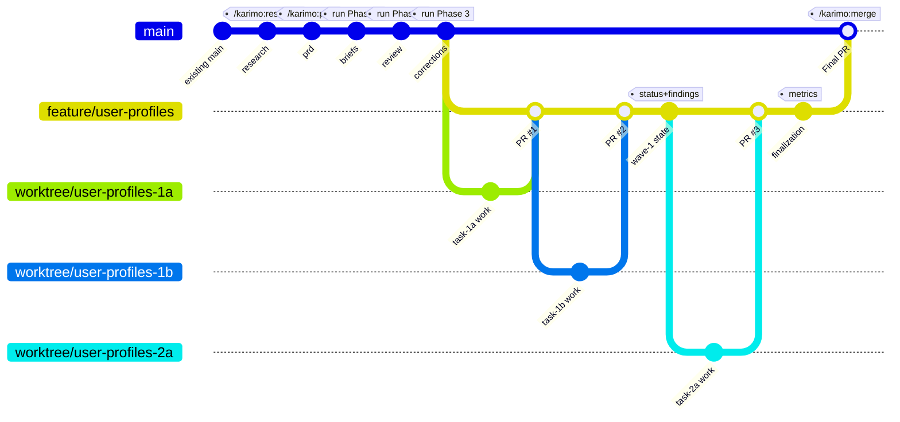

# Commit Strategy — KARIMO Lifecycle

This document defines the atomic commit strategy for KARIMO execution. Understanding when and where commits happen ensures traceability and enables crash recovery.

---

## Mental Model

The commit lifecycle has **two distinct phases** with different commit targets:

```
┌─────────────────────────────────────────────────────────────────────┐
│  PHASE A: Pre-Orchestration (commits to main)                       │
│                                                                     │
│    Research → PRD → Briefs → Review → Corrections                   │
│                                                                     │
│    All preparation happens on main before orchestration begins      │
└─────────────────────────────────────────────────────────────────────┘
                              │
                              ▼
┌─────────────────────────────────────────────────────────────────────┐
│  PHASE B: Orchestration (commits to worktrees → feature branch)     │
│                                                                     │
│    Worktrees grow → Task commits → PR merges → Worktrees collapse   │
│    State files committed to feature branch between waves            │
│                                                                     │
│    Work happens in isolated worktrees, flows to feature branch      │
└─────────────────────────────────────────────────────────────────────┘
```

---

## Visual Timeline



---

## Phase A: Pre-Orchestration Commits (to main)

All preparation work commits directly to `main` before orchestration begins.

| Checkpoint | Command | Files | Commit Message |
|------------|---------|-------|----------------|
| Research (internal) | `/karimo:research` | `research/internal/` | `docs(karimo): internal research for {slug}` |
| Research (external) | `/karimo:research` | `research/external/` | `docs(karimo): external research for {slug}` |
| Research (summary) | `/karimo:research` | `research/summary.md` | `docs(karimo): complete research summary for {slug}` |
| PRD | `/karimo:plan` | `PRD_{slug}.md`, `tasks.yaml`, `execution_plan.yaml` | `docs(karimo): add PRD for {slug}` |
| Briefs | `/karimo:run` Phase 1 | `briefs/*.md` | `docs(karimo): generate task briefs for {slug}` |
| Review | `/karimo:run` Phase 2 | `recommendations.md` | `docs(karimo): brief review findings for {slug}` |
| Corrections | `/karimo:run` Phase 3 | Updated `briefs/*.md`, `tasks.yaml` | `docs(karimo): apply brief corrections for {slug}` |

### Pre-Orchestration Commit Templates

**Research (internal):**
```bash
git add .karimo/prds/{slug}/research/internal/
git commit -m "docs(karimo): internal research for {slug}

Discovered {N} patterns, mapped {N} dependencies, identified {N} issues.

Co-Authored-By: Claude <noreply@anthropic.com>"
```

**Research (external):**
```bash
git add .karimo/prds/{slug}/research/external/
git commit -m "docs(karimo): external research for {slug}

Researched {N} best practices, evaluated {N} libraries, found {N} references.

Co-Authored-By: Claude <noreply@anthropic.com>"
```

**Research (summary):**
```bash
git add .karimo/prds/{slug}/research/summary.md .karimo/prds/{slug}/research/meta.json
git commit -m "docs(karimo): complete research summary for {slug}

Co-Authored-By: Claude <noreply@anthropic.com>"
```

**PRD:**
```bash
git add .karimo/prds/{NNN}_{slug}/
git commit -m "docs(karimo): add PRD for {slug}

Generated via /karimo:plan interview.
Research context: {included|not included}

Files:
- PRD_{slug}.md
- tasks.yaml
- execution_plan.yaml
- status.json

Co-Authored-By: Claude <noreply@anthropic.com>"
```

**Briefs:**
```bash
git add .karimo/prds/{NNN}_{slug}/briefs/
git commit -m "docs(karimo): generate task briefs for {slug}

Generated {count} briefs with research context.

Co-Authored-By: Claude <noreply@anthropic.com>"
```

**Review Findings:**
```bash
git add .karimo/prds/{NNN}_{slug}/recommendations.md
git commit -m "docs(karimo): brief review findings for {slug}

Critical: {n} | Warnings: {n} | Observations: {n}

Co-Authored-By: Claude <noreply@anthropic.com>"
```

**Corrections:**
```bash
git add .karimo/prds/{NNN}_{slug}/briefs/ .karimo/prds/{NNN}_{slug}/tasks.yaml
git commit -m "docs(karimo): apply brief corrections for {slug}

Applied {n} critical fixes from review.

Co-Authored-By: Claude <noreply@anthropic.com>"
```

---

## Phase B: Orchestration Commits (to feature branch)

### The "Grow and Collapse" Pattern

Worktrees are temporary work areas that follow a lifecycle:

1. **Grow:** Create worktree for task, work happens, commits accumulate
2. **Collapse:** Task PR merges to feature branch, worktree deleted
3. **State commit:** PM commits `status.json` + `findings.md` to feature branch
4. **Repeat:** Next wave grows new worktrees
5. **Final:** Feature branch contains all task commits + state files, merges to main

```
main
  │
  └── feature/{slug} (created from main)
        │
        ├── worktree/{slug}-1a ──[COMMIT]──┐
        ├── worktree/{slug}-1b ──[COMMIT]──┤
        │                                   │
        │    Wave 1 PRs merge ◄─────────────┘
        │         │
        │    [Worktrees collapse, branches deleted]
        │    [COMMIT] State update: status.json, findings.md
        │         │
        ├── worktree/{slug}-2a ──[COMMIT]──┐
        ├── worktree/{slug}-2b ──[COMMIT]──┤
        │                                   │
        │    Wave 2 PRs merge ◄─────────────┘
        │         │
        │    [Worktrees collapse, branches deleted]
        │    [COMMIT] State update: status.json, findings.md
        │         │
        └── All waves complete
              │
              [COMMIT] Finalization: metrics.json
              │
              └── /karimo:merge → Final PR to main
```

### Orchestration Commit Table

| Checkpoint | Trigger | Target | Files | Commit Message |
|------------|---------|--------|-------|----------------|
| Task work | Worker agent | worktree branch | Task code | `feat({slug}): [{task-id}] {task-title}` |
| Wave complete | All wave PRs merged | feature branch | `status.json`, `findings.md` | `chore(karimo): complete wave {n} for {slug}` |
| Finalization | All tasks done | feature branch | `status.json`, `metrics.json`, `findings.md` | `chore(karimo): complete execution for {slug}` |
| Final merge | `/karimo:merge` | main | All feature branch commits | PR merge commit |

### Orchestration Commit Templates

**Task Work (by worker agents):**
```bash
# Committed by karimo-implementer, karimo-tester, or karimo-documenter
git commit -m "feat({slug}): [{task-id}] {task-title}

{Brief description of changes}

Co-Authored-By: Claude <noreply@anthropic.com>"
```

**Wave Completion (by PM agent):**
```bash
git add .karimo/prds/{NNN}_{slug}/status.json
git add .karimo/prds/{NNN}_{slug}/findings.md
git commit -m "chore(karimo): complete wave {n} for {slug}

Tasks merged: {task_ids}
Findings: {finding_count} discoveries

Co-Authored-By: Claude <noreply@anthropic.com>"
```

**Finalization (by PM agent):**
```bash
git add .karimo/prds/{NNN}_{slug}/status.json
git add .karimo/prds/{NNN}_{slug}/metrics.json
git add .karimo/prds/{NNN}_{slug}/findings.md
git commit -m "chore(karimo): complete execution for {slug}

Tasks: {done}/{total} complete
Duration: {duration} minutes

Co-Authored-By: Claude <noreply@anthropic.com>"
```

---

## Feature Branch Lifecycle

### Creation

The feature branch is created by `/karimo:run` Phase 4 (Orchestrate):

```bash
git checkout main
git pull origin main
git checkout -b feature/{slug}
git push -u origin feature/{slug}
```

### During Execution

1. Task PRs merge from `worktree/{slug}-{task-id}` → `feature/{slug}`
2. PM agent commits state files to `feature/{slug}` after each wave
3. Worktree branches are deleted after PR merge

### Final Merge

`/karimo:merge` creates a PR from `feature/{slug}` → `main`:

```bash
gh pr create \
  --base main \
  --head feature/{slug} \
  --title "feat({slug}): complete implementation" \
  --body "..."
```

After merge, the feature branch is deleted:

```bash
git push origin --delete feature/{slug}
```

---

## Commit Boundaries Summary

### Who Commits Where

| Agent | Target | Commits |
|-------|--------|---------|
| `/karimo:research` | main | Research artifacts (3 commits) |
| `/karimo:plan` | main | PRD artifacts (1 commit) |
| `/karimo:run` Phase 1 | main | Task briefs (1 commit) |
| `/karimo:run` Phase 2 | main | Review findings (1 commit) |
| `/karimo:run` Phase 3 | main | Corrections (1 commit, if applied) |
| Worker agents | worktree branch | Task implementation |
| PM agent | feature branch | State files (per wave + finalization) |

### Crash Recovery

Because commits are atomic and frequent:

- **Pre-orchestration crash:** Resume from last committed artifact
- **Mid-wave crash:** PM reconciles from git state (Step 2 in pm.md)
- **Post-wave crash:** State files committed, next wave can proceed
- **Finalization crash:** Re-run finalization, idempotent

---

## Anti-Patterns

| Don't | Do Instead |
|-------|------------|
| Commit all PRD artifacts at end | Commit after each phase |
| Commit briefs + review together | Separate commits for briefs, review, corrections |
| Skip state commits between waves | Always commit status.json + findings.md |
| Commit to main during orchestration | Commit to feature branch (or worktree for tasks) |
| Leave uncommitted work | Commit before moving to next step |

---

## Related Documentation

- [ARCHITECTURE.md](ARCHITECTURE.md) — System design overview
- [COMMANDS.md](COMMANDS.md) — Command reference
- [GETTING-STARTED.md](GETTING-STARTED.md) — Installation guide

---

*Generated by [KARIMO](https://github.com/opensesh/KARIMO)*
