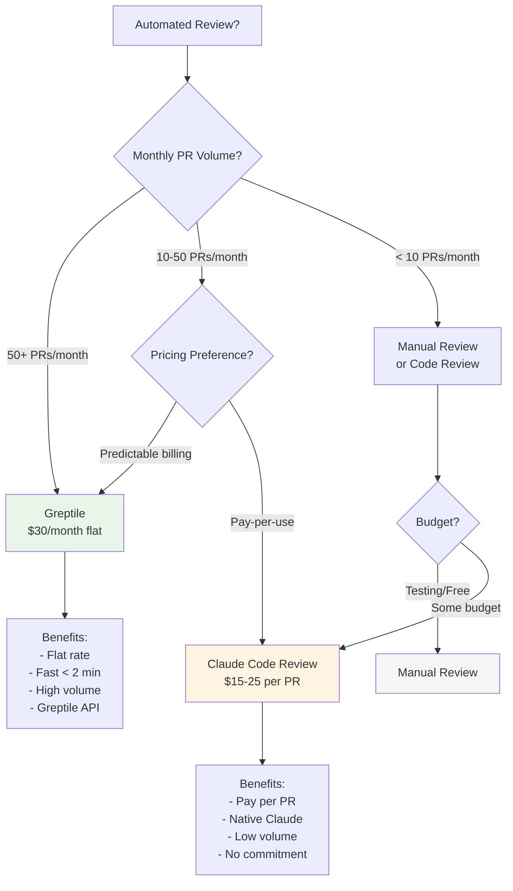
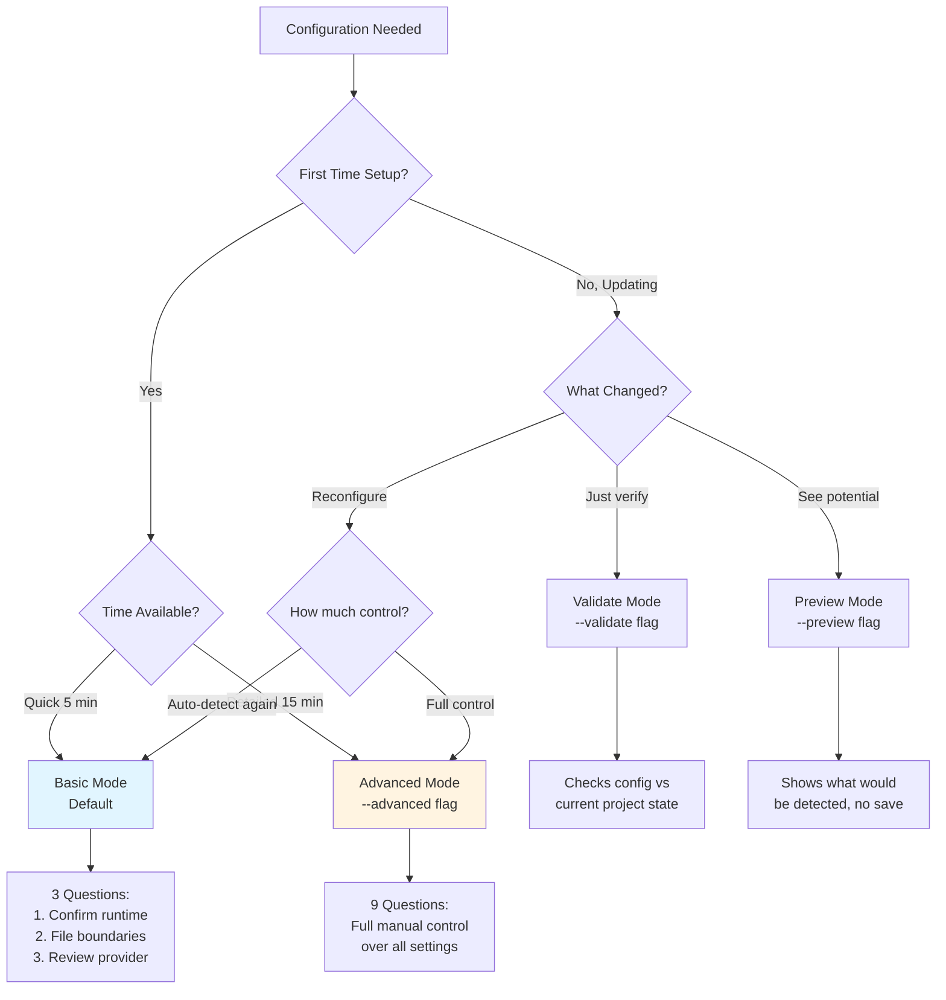
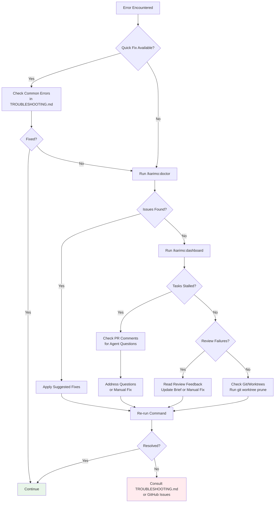

# KARIMO Decision Trees

Visual guides to help you choose the right command, configuration, or workflow for your situation.

---

## Table of Contents

- [Which Command Should I Use?](#which-command-should-i-use)
- [Execution Model: Feature Branch vs Direct-to-Main](#execution-model-feature-branch-vs-direct-to-main)
- [Should I Enable Automated Review?](#should-i-enable-automated-review)
- [Configuration Mode Selection](#configuration-mode-selection)
- [When to Use Which Agent?](#when-to-use-which-agent)
- [Error Recovery Decision Tree](#error-recovery-decision-tree)

---

## Which Command Should I Use?

### Starting a new feature?

```
→ /karimo:plan
```

**Creates a new PRD through structured interview.**

- First time? You'll go through inline configuration first
- Existing config? Interview starts immediately
- Takes ~10 minutes for initial PRD

---

### PRD already exists and approved?

```
→ /karimo:run --prd {slug}
```

**Executes tasks from an approved PRD using feature branch workflow (recommended).**

- Creates feature branch
- Wave-based parallel execution
- PRs target feature branch
- Merge to main via `/karimo:merge` when complete

---

### Need to change an approved PRD?

**Edit PRD files directly:**
```
.karimo/prds/{slug}/PRD_{slug}.md   # Requirements
.karimo/prds/{slug}/tasks.yaml      # Task definitions
```

**Then re-run:**
```
→ /karimo:run --prd {slug}
```

Use cases:
- Fix requirements before execution starts
- Update task complexity or dependencies
- Add/remove tasks
- Correct file paths or patterns

**Important:** Modifying during execution requires re-generating briefs and may affect in-flight tasks.

---

### Want to check execution progress?

**Quick overview (all PRDs):**
```
→ /karimo:dashboard
```

Shows:
- All PRD names and status
- Total tasks / completed / failed
- Current wave
- Last activity timestamp

**Detailed view (specific PRD):**
```
→ /karimo:dashboard --prd {slug}
```

Shows:
- Per-task status and complexity
- PR links and review status
- Stalled tasks with reasons
- Wave progression details

**Comprehensive metrics:**
```
→ /karimo:dashboard
```

Shows:
- Execution timeline visualization
- Task distribution by complexity
- Review pass rates
- Model escalation frequency
- Average task duration
- Wave parallelism metrics

---

### Ready to merge feature to main?

```
→ /karimo:merge --prd {slug}
```

**Creates final PR from feature branch to main.**

Prerequisites:
- All tasks in PRD completed and merged to feature branch
- Feature branch builds and tests pass
- Ready for final review before main

---

### Something broken or unclear?

**Health check:**
```
→ /karimo:doctor
```

Runs 7 diagnostic categories:
- Installation check
- Configuration validation
- Git status
- GitHub CLI authentication
- Dependencies verification
- Boundaries validation
- Worktree cleanup

**Installation verification:**
```
→ /karimo:doctor --test
```

End-to-end smoke test:
- Creates test PRD
- Generates briefs
- Validates agent spawning
- Cleans up artifacts

**Get help:**
```
→ /karimo:help
```

Lists all commands or searches docs for specific topics.

---

### Need to capture learnings?

```
→ /karimo:feedback
```

**Auto-detects simple vs. complex feedback:**

- **Simple feedback** (single pattern/anti-pattern): Direct append to learnings
- **Complex feedback** (investigation needed): Spawns auditor agent to gather evidence

Use after:
- Discovering a useful pattern
- Identifying an anti-pattern to avoid
- Noting a framework-specific quirk
- Recording boundary adjustments

---

### Need to update KARIMO?

```
→ /karimo:update
```

**Checks for and applies updates from GitHub.**

Options:
- `--check` - Check without installing
- `--force` - Update even if on latest
- `--ci` - Non-interactive mode

Preserves:
- `.karimo/config.yaml`
- `.karimo/learnings/`
- `.karimo/prds/*`
- Custom content in `CLAUDE.md`

---

## Execution Model: Feature Branch vs Direct-to-Main

### Decision Tree

```mermaid
graph TD
    A[Choose Execution Model] --> B{Team Size?}
    B -->|Solo Developer| C{Change Size?}
    B -->|Multiple Developers| D[Feature Branch Model]

    C -->|1-2 tasks,<br/>hotfix| E[Direct-to-Main]
    C -->|3+ tasks,<br/>new feature| D

    D --> F[/karimo:run --prd {slug}]
    E --> G[/karimo:run --prd {slug}]

    F --> H[Benefits:<br/>- Complete isolation<br/>- Parallel execution<br/>- Independent review<br/>- Easy rollback]

    G --> I[Benefits:<br/>- Faster for small changes<br/>- Simpler workflow<br/>- No final merge step]

    style D fill:#e1f5ff
    style E fill:#fff4e1
```

### Use `/karimo:run` (Feature Branch) if:

✅ Multiple developers on project
✅ Need code review before main
✅ Want wave-based parallel execution
✅ Large features (5+ tasks)
✅ Need isolation from main branch
✅ Want to test full feature before main merge

**Workflow:**
1. `/karimo:run --prd {slug}` creates `feature/{slug}`
2. Tasks create PRs → feature branch
3. Waves execute in parallel
4. `/karimo:merge --prd {slug}` creates final PR → main

---

### Use `/karimo:run` (Direct-to-Main) if:

✅ Solo developer
✅ Hotfix or urgent change
✅ Small change (1-2 tasks)
✅ Legacy mode (v4.0 workflow)
✅ Comfortable with PRs directly to main

**Workflow:**
1. `/karimo:run --prd {slug}`
2. Tasks create PRs → main
3. Waves execute (Wave 2 waits for Wave 1)
4. PRs merge directly to main (no final merge step)

---

### Recommendation

**Default to `/karimo:run` for most cases.**

The feature branch model provides better isolation, easier rollback, and cleaner separation of concerns. Only use direct-to-main for solo projects or small urgent changes.

---

## Should I Enable Automated Review?

### Decision Tree



### Use Greptile ($30/month) if:

✅ High volume (50+ PRs/month)
✅ Need fast reviews (< 2 minutes)
✅ Want flat, predictable pricing
✅ Multiple PRDs running simultaneously
✅ Team coordination with shared budget

**Setup:**
```bash
/karimo:configure --advanced
# Select "Yes" for automated review
# Choose "Greptile" as provider
# Add GREPTILE_API_KEY to GitHub secrets
```

**Features:**
- 0-5 quality score per PR
- Score < 3 triggers agent revision
- Model escalation (Sonnet → Opus)
- Hard gate after 3 loops

---

### Use Claude Code Review ($15-25/PR) if:

✅ Low-medium volume (< 50 PRs/month)
✅ Prefer pay-per-use billing
✅ Want native Claude integration
✅ Testing automated review first
✅ Occasional PRD execution

**Setup:**
```bash
/karimo:configure --advanced
# Select "Yes" for automated review
# Choose "Code Review" as provider
```

**Features:**
- Inline comments with severity (🔴 🟡 🟣)
- 🔴 findings trigger revision loops
- Integrated with Claude Code dashboard
- Per-PR billing

---

### Skip Automated Review if:

✅ Just testing KARIMO
✅ Manual review preferred
✅ Budget constrained
✅ Very low volume (< 5 PRs/month)

**Workflow:**
- PRs created normally
- Human reviews via GitHub
- Manual approval and merge
- No revision loops

**Note:** You can always add automated review later via `/karimo:configure --advanced`.

---

## Configuration Mode Selection

### Decision Tree



### Basic Mode (Default) — 5 minutes

**Command:**
```bash
/karimo:configure
```

**Questions (3 total):**
1. Confirm detected runtime/framework?
2. Which files should agents never touch? (common patterns shown)
3. Enable automated review? (Y/n, default No)

**When to use:**
- First-time setup
- Project follows standard conventions
- Trust auto-detection
- Want quick setup

---

### Advanced Mode — 15 minutes

**Command:**
```bash
/karimo:configure --advanced
```

**Questions (9 total):**
1. Runtime selection (manual)
2. Framework selection (manual)
3. Package manager
4. Build command
5. Test command
6. Lint command
7. Typecheck command
8. File boundaries (`never_touch` + `require_review`)
9. Automated review provider

**When to use:**
- Non-standard project structure
- Auto-detection failed
- Need precise control
- Custom build commands

---

### Preview Mode — 1 minute

**Command:**
```bash
/karimo:configure --preview
```

**What it does:**
- Shows what would be auto-detected
- Does NOT save to config.yaml
- Exits immediately

**When to use:**
- Curious what auto-detection finds
- Verify detection before committing
- Compare with existing config

---

### Validate Mode — 1 minute

**Command:**
```bash
/karimo:configure --validate
```

**What it does:**
- Checks `.karimo/config.yaml` against current project
- Reports drift and mismatches
- Suggests fixes

**When to use:**
- Project dependencies changed (npm → pnpm)
- Build tools updated (Webpack → Vite)
- Commands renamed in package.json
- Periodic health check

---

### Auto Mode (CI/Testing) — 30 seconds

**Command:**
```bash
/karimo:configure --auto
```

**What it does:**
- Accepts all defaults
- No user interaction
- Exits immediately

**When to use:**
- CI/CD pipelines
- Automated testing
- Scripted installations

---

## When to Use Which Agent?

Most users don't invoke agents directly — PM Agent coordinates them. But understanding agent roles helps debug issues.

### Coordination Agents (User Never Invokes)

| Agent | Invoked By | Purpose |
|-------|------------|---------|
| **Interviewer** | `/karimo:plan` | Conducts PRD interview |
| **Investigator** | `/karimo:configure` or `/karimo:plan` | Scans codebase for patterns |
| **Reviewer** | `/karimo:plan` (Round 5) | Validates PRD, generates DAG |
| **Brief Writer** | `/karimo:run` (Phase 1) | Generates task briefs |
| **Brief Reviewer** | `/karimo:run` (before execution) | Pre-execution validation |
| **Brief Corrector** | `/karimo:run` (after review) | Applies corrections from findings |
| **PM Agent** | `/karimo:run` or `/karimo:run` | Coordinates task execution |
| **Review Architect** | PM Agent (on conflicts) | Resolves merge conflicts |
| **Feedback Auditor** | `/karimo:feedback` (complex mode) | Investigates feedback issues |

### Task Agents (PM Agent Selects)

PM Agent chooses based on task type and complexity:

| Task Type | Complexity 1-4 | Complexity 5+ |
|-----------|----------------|---------------|
| **Implementation** | karimo-implementer (Sonnet) | karimo-implementer-opus (Opus) |
| **Testing** | karimo-tester (Sonnet) | karimo-tester-opus (Opus) |
| **Documentation** | karimo-documenter (Sonnet) | karimo-documenter-opus (Opus) |

**Selection Logic:**
- PM reads task title/description for type
- PM reads complexity field from tasks.yaml
- Complexity < 5 → Sonnet variant
- Complexity ≥ 5 → Opus variant

---

## Error Recovery Decision Tree

### When Something Goes Wrong



### Step-by-Step Recovery

1. **Run diagnostics:**
   ```bash
   /karimo:doctor
   ```

2. **Check execution status:**
   ```bash
   /karimo:dashboard --prd {slug}
   ```

3. **Review PRs for issues:**
   ```bash
   gh pr list --label "prd:{slug}"
   gh pr view {pr-number}
   ```

4. **Check worktrees:**
   ```bash
   git worktree list
   git worktree prune  # Clean up stale worktrees
   ```

5. **Consult documentation:**
   - [TROUBLESHOOTING.md](TROUBLESHOOTING.md) — Common errors
   - [GLOSSARY.md](GLOSSARY.md) — Terminology
   - [ARCHITECTURE.md](ARCHITECTURE.md) — System design

6. **Report issue if unresolved:**
   ```bash
   # Gather context
   /karimo:doctor > doctor-output.txt
   /karimo:dashboard --prd {slug} > status-output.txt

   # Create GitHub issue with outputs
   ```

---

## Quick Reference Card

### Most Common Workflows

**Create and execute a feature:**
```bash
/karimo:plan                      # Create PRD
/karimo:run --prd my-feature      # Execute tasks
/karimo:dashboard --prd my-feature   # Check progress
/karimo:merge --prd my-feature    # Final PR to main
```

**Diagnose issues:**
```bash
/karimo:doctor                    # Health check
/karimo:dashboard                    # Overview
/karimo:dashboard                 # Detailed metrics
```

**Configuration:**
```bash
/karimo:configure                 # Basic mode (default)
/karimo:configure --advanced      # Full control
/karimo:configure --preview       # See detection
/karimo:configure --validate      # Check drift
```

**Help and updates:**
```bash
/karimo:help                      # Command list or doc search
/karimo:update                    # Update KARIMO
```

---

## Related Documentation

- [COMMANDS.md](COMMANDS.md) — Complete command reference
- [GLOSSARY.md](GLOSSARY.md) — Terminology definitions
- [TROUBLESHOOTING.md](TROUBLESHOOTING.md) — Error solutions
- [GETTING-STARTED.md](GETTING-STARTED.md) — Installation and first PRD
- [PHASES.md](PHASES.md) — Adoption phases explained

---

*Last updated: 2026-03-11*
