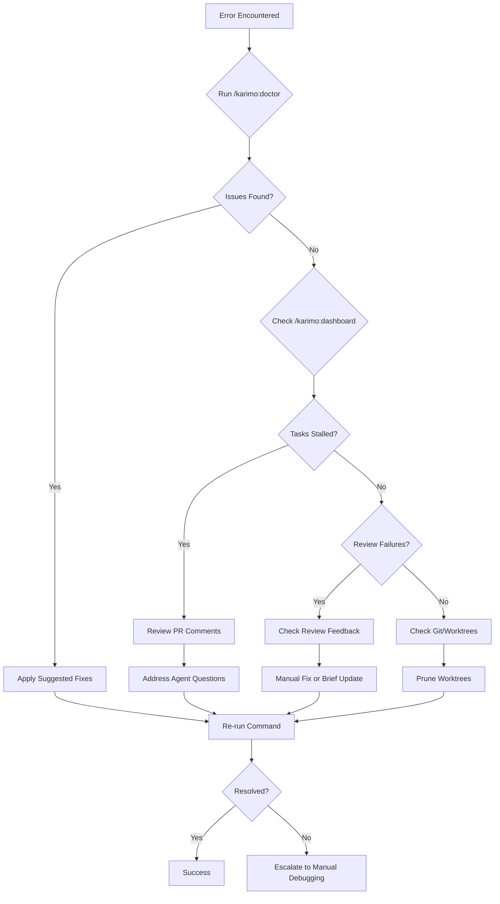

# KARIMO Troubleshooting Guide

Comprehensive solutions for common KARIMO issues across installation, configuration, execution, and review workflows.

**Quick Diagnostics:** Run `/karimo:doctor` for automated health checks before manual troubleshooting.

---

## Table of Contents

- [Installation Issues](#installation-issues)
- [Configuration Issues](#configuration-issues)
- [Execution Issues](#execution-issues)
- [Review Issues](#review-issues)
- [Git & Branch Issues](#git--branch-issues)
- [Performance Issues](#performance-issues)
- [Recovery & Rollback](#recovery--rollback)
- [Diagnostic Commands](#diagnostic-commands)

---

## Installation Issues

### Commands not found after install

**Symptoms:**
- `/karimo:plan` or other commands show "command not found"
- Commands don't appear in Claude Code autocomplete

**Causes:**
- Commands cached on Claude Code startup
- Installation completed but session not reloaded
- `.claude/commands/` files not properly copied

**Solutions:**

1. **Restart Claude Code completely:**
   ```bash
   # Exit Claude Code CLI
   # Restart Claude Code application
   ```

2. **Verify installation:**
   ```bash
   ls -la .claude/commands/ | grep karimo
   # Should show 11 command files
   ```

3. **Re-run installation:**
   ```bash
   cd /path/to/KARIMO
   bash install.sh /path/to/your/project
   ```

4. **Check MANIFEST.json:**
   ```bash
   cat .karimo/MANIFEST.json
   # Verify "commands" array contains 11 entries
   ```

---

### GitHub CLI not authenticated

**Symptoms:**
- `/karimo:run` fails with "gh auth required"
- PR creation errors: "authentication failed"

**Causes:**
- GitHub CLI not installed
- Not authenticated with GitHub
- Missing `repo` scope in token

**Solutions:**

1. **Install GitHub CLI:**
   ```bash
   # macOS
   brew install gh

   # Ubuntu/Debian
   sudo apt install gh

   # Windows
   winget install GitHub.cli
   ```

2. **Authenticate with GitHub:**
   ```bash
   gh auth login
   # Follow prompts, select HTTPS, authenticate via browser
   ```

3. **Verify authentication:**
   ```bash
   gh auth status
   # Should show: "Logged in to github.com as <username>"
   ```

4. **Check scopes:**
   ```bash
   gh auth refresh -s repo
   # Ensures repo scope is granted
   ```

---

### Installation script fails mid-process

**Symptoms:**
- `install.sh` exits with error
- Partial installation (some files copied, others missing)

**Causes:**
- Insufficient permissions
- Target directory doesn't exist
- Corrupted source files

**Solutions:**

1. **Check permissions:**
   ```bash
   ls -la /path/to/project
   # Ensure you have write access
   ```

2. **Verify target directory:**
   ```bash
   # Target must be git repository root
   cd /path/to/project
   git rev-parse --show-toplevel
   ```

3. **Clean partial installation:**
   ```bash
   bash /path/to/KARIMO/uninstall.sh /path/to/project
   # Then reinstall
   bash /path/to/KARIMO/install.sh /path/to/project
   ```

4. **Check source integrity:**
   ```bash
   cd /path/to/KARIMO
   git status
   # Should show clean working tree
   ```

---

## Configuration Issues

### Auto-detection failed during `/karimo:configure`

**Symptoms:**
- Investigator agent can't detect runtime
- Framework detection returns "unknown"
- Build commands not auto-detected

**Causes:**
- Non-standard project structure
- Missing package.json or equivalent
- Unconventional framework setup

**Solutions:**

1. **Use Advanced Mode for manual config:**
   ```bash
   /karimo:configure --advanced
   # Manually specify all settings
   ```

2. **Verify project files exist:**
   ```bash
   # Node.js
   ls package.json

   # Python
   ls requirements.txt setup.py pyproject.toml

   # Ruby
   ls Gemfile

   # Go
   ls go.mod
   ```

3. **Check framework-specific files:**
   ```bash
   # Next.js
   ls next.config.js next.config.mjs

   # Django
   ls manage.py

   # Rails
   ls config/application.rb
   ```

4. **Preview config before saving:**
   ```bash
   /karimo:configure --preview
   # Review detected settings, then run full configure
   ```

---

### Config validation fails

**Symptoms:**
- `/karimo:configure --validate` reports drift
- Commands don't match current project state
- Runtime mismatch between config and reality

**Causes:**
- Project evolved after initial configuration
- Dependencies changed (e.g., npm → pnpm)
- Build tools updated (e.g., Webpack → Vite)

**Solutions:**

1. **Review drift report:**
   ```bash
   /karimo:configure --validate
   # Shows specific mismatches
   ```

2. **Re-run configuration:**
   ```bash
   /karimo:configure
   # Auto-detection will update to current state
   ```

3. **Manual config edit:**
   ```bash
   # Edit .karimo/config.yaml directly
   # Update runtime, framework, or commands sections
   ```

4. **Verify commands work:**
   ```bash
   # Test build command from config
   npm run build  # or equivalent

   # Test test command
   npm test
   ```

---

### Glob patterns too restrictive

**Symptoms:**
- Agents refuse to modify files they should be allowed to touch
- PRs fail with "boundary violation" errors
- Tasks blocked on legitimate file edits

**Causes:**
- Overly broad `never_touch` patterns
- Incorrect glob syntax
- Patterns match unintended files

**Solutions:**

1. **Review current boundaries:**
   ```yaml
   # .karimo/config.yaml
   boundaries:
     never_touch:
       - "node_modules/**"  # Good
       - "src/**"           # Too broad! Blocks all src files
   ```

2. **Use more specific patterns:**
   ```yaml
   never_touch:
     - "src/generated/**"   # Good: only generated files
     - "src/migrations/**"  # Good: only migrations
   ```

3. **Test patterns before saving:**
   ```bash
   # Use find to test glob matches
   find . -path "./src/**" -type f
   # Shows what would be matched
   ```

4. **Consult pattern library:**
   - See [GLOB_PATTERNS.md](GLOB_PATTERNS.md) for framework-specific examples

---

## Execution Issues

### Pre-execution review failed

**Symptoms:**
- `/karimo:run` stops after brief review
- `findings.md` contains critical issues
- Tasks can't proceed until corrected

**Causes:**
- Briefs reference non-existent files
- Briefs contradict codebase patterns
- Dependencies not accurately captured

**Solutions:**

1. **Review findings:**
   ```bash
   cat .karimo/prds/{slug}/findings.md
   # Read all critical findings
   ```

2. **Run review-only mode:**
   ```bash
   /karimo:run --prd {slug} --review-only
   # See findings without starting execution
   ```

3. **Edit PRD files to fix issues:**
   ```bash
   # Edit PRD and tasks directly:
   # .karimo/prds/{slug}/PRD_{slug}.md
   # .karimo/prds/{slug}/tasks.yaml
   ```

4. **Re-run with corrections:**
   ```bash
   # After modifications, try again
   /karimo:run --prd {slug}
   ```

5. **Skip review (if confident):**
   ```bash
   # Use with caution
   /karimo:run --prd {slug} --skip-review
   ```

---

### Task stalled for 24+ hours

**Symptoms:**
- Task shows `stalled` status in `/karimo:dashboard`
- No PR activity or agent updates
- Wave execution blocked waiting for task

**Causes:**
- Agent waiting for user input
- Unhandled error in agent execution
- Worktree conflict or git issue
- Review bottleneck (human review required)

**Solutions:**

1. **Check task status details:**
   ```bash
   /karimo:dashboard --prd {slug}
   # Shows which task is stalled and why
   ```

2. **Review PR comments:**
   ```bash
   gh pr view {pr-number}
   # Check for agent questions or errors
   ```

3. **Check worktree state:**
   ```bash
   git worktree list
   # Verify task worktree exists and is healthy
   ```

4. **Manually intervene on PR:**
   - Address agent questions in PR comments
   - Approve review if waiting for human approval
   - Merge PR if ready but not auto-merged

5. **Resume execution:**
   ```bash
   # After resolving blocker
   /karimo:run --prd {slug}
   # PM agent will resume from checkpoint
   ```

---

### Wave 2 won't start despite Wave 1 complete

**Symptoms:**
- All Wave 1 PRs merged
- Wave 2 tasks still showing `queued`
- No errors in `/karimo:dashboard`

**Causes:**
- PM agent hasn't detected Wave 1 completion
- Status not updated in status.json
- Dependency graph cache stale

**Solutions:**

1. **Verify Wave 1 status:**
   ```bash
   cat .karimo/prds/{slug}/status.json | jq '.tasks[] | select(.wave == 1)'
   # All should show status: "completed"
   ```

2. **Manually update status:**
   ```json
   // .karimo/prds/{slug}/status.json
   {
     "tasks": [
       {
         "id": "task-1",
         "wave": 1,
         "status": "completed"  // Ensure this is set
       }
     ]
   }
   ```

3. **Re-trigger execution:**
   ```bash
   /karimo:run --prd {slug}
   # PM agent will re-evaluate wave readiness
   ```

4. **Check dependency graph:**
   ```bash
   cat .karimo/prds/{slug}/dependencies.json
   # Verify Wave 2 dependencies are satisfied
   ```

---

### Agent can't find file referenced in brief

**Symptoms:**
- Task fails with "file not found" error
- Agent reports path doesn't exist
- PR shows empty changes

**Causes:**
- Brief references file that doesn't exist yet
- Typo in file path in PRD
- File was renamed/moved since PRD creation
- Task depends on another task that hasn't run yet

**Solutions:**

1. **Verify file exists:**
   ```bash
   ls -la path/to/file.ts
   # Check if file actually exists
   ```

2. **Check task dependencies:**
   ```yaml
   # .karimo/prds/{slug}/tasks.yaml
   - id: task-2
     depends_on: [task-1]  # Ensure task-1 creates the file
   ```

3. **Edit PRD with correct path:**
   ```bash
   # Edit: .karimo/prds/{slug}/PRD_{slug}.md
   # Correct file path, then re-run /karimo:run to regenerate briefs
   ```

4. **Check wave ordering:**
   - File creation task must be in earlier wave than usage task
   - Re-run reviewer to recalculate waves if needed

---

### Complexity score seems wrong

**Symptoms:**
- Simple task assigned complexity 8 (using Opus unnecessarily)
- Complex task assigned complexity 2 (failing due to Sonnet limitations)

**Causes:**
- Reviewer agent misjudged scope
- Task description unclear
- Complexity heuristics need calibration

**Solutions:**

1. **Manually override in tasks.yaml:**
   ```yaml
   # .karimo/prds/{slug}/tasks.yaml
   - id: task-1
     name: "Add button component"
     complexity: 2  # Change from 8 to 2
     agent_type: "implementer"  # Change from implementer-opus
   ```

2. **Improve task description:**
   ```bash
   # Edit: .karimo/prds/{slug}/PRD_{slug}.md
   # Add more details or clarify scope
   ```

3. **Re-run reviewer:**
   ```bash
   # After modifying PRD
   /karimo:plan  # Will re-run review phase
   ```

---

## Review Issues

### Greptile review timed out

**Symptoms:**
- Task stuck in `in-review` status
- No review feedback after 10+ minutes
- Greptile API errors in logs

**Causes:**
- Greptile API rate limits
- Greptile service outage
- Network connectivity issues
- PR too large for review

**Solutions:**

1. **Check Greptile status:**
   ```bash
   # Visit status.greptile.com or check Greptile dashboard
   ```

2. **Retry review:**
   ```bash
   # Trigger review manually via GitHub UI
   # Or wait 5 minutes and PM agent will retry
   ```

3. **Check API key:**
   ```bash
   # Verify GREPTILE_API_KEY in .env or GitHub secrets
   echo $GREPTILE_API_KEY
   ```

4. **Fallback to manual review:**
   ```bash
   # Review PR manually and approve
   gh pr review {pr-number} --approve
   ```

5. **Split large PR:**
   - If PR changes 50+ files, consider breaking task into smaller units

---

### Code Review endless loop (3+ revisions)

**Symptoms:**
- Task hits hard gate after 3 loops
- Review keeps finding same issues
- Agent not learning from feedback

**Causes:**
- Review feedback ambiguous
- Agent misunderstanding requirements
- Conflicting style rules
- Legitimate bug agent can't fix autonomously

**Solutions:**

1. **Review loop history:**
   ```bash
   gh pr view {pr-number}
   # Read all review comments to understand pattern
   ```

2. **Manual intervention:**
   ```bash
   # Take over PR manually
   git fetch origin {branch}
   git checkout {branch}
   # Make fixes, push, request re-review
   ```

3. **Update learnings:**
   ```bash
   /karimo:feedback
   # Document pattern to prevent future occurrences
   ```

4. **Adjust review strictness:**
   - Check Greptile/Code Review settings
   - May need to tune review rules

---

### Review approved but PR not merging

**Symptoms:**
- Review status: "approved"
- PR still open after 30+ minutes
- PM agent hasn't merged

**Causes:**
- Merge conflicts with base branch
- CI/CD checks failing
- Branch protection rules blocking merge
- PM agent not polling for status

**Solutions:**

1. **Check PR status:**
   ```bash
   gh pr view {pr-number} --json mergeStateStatus
   # Look for blockers
   ```

2. **Resolve merge conflicts:**
   ```bash
   git fetch origin
   git checkout {branch}
   git merge origin/main  # or feature branch
   # Resolve conflicts, push
   ```

3. **Check CI status:**
   ```bash
   gh pr checks {pr-number}
   # Verify all checks passing
   ```

4. **Manual merge:**
   ```bash
   gh pr merge {pr-number} --squash
   # Or use GitHub UI
   ```

---

## Git & Branch Issues

### Worktree already exists error

**Symptoms:**
- Task fails to start with "worktree already exists"
- Git reports worktree path in use

**Causes:**
- Previous task crashed without cleanup
- Manual worktree creation conflict
- Worktree path collision

**Solutions:**

1. **List existing worktrees:**
   ```bash
   git worktree list
   # Shows all active worktrees
   ```

2. **Remove stale worktree:**
   ```bash
   git worktree remove path/to/worktree
   # Or force remove if corrupted
   git worktree remove --force path/to/worktree
   ```

3. **Prune worktrees:**
   ```bash
   git worktree prune
   # Removes all orphaned worktrees
   ```

4. **Re-run task:**
   ```bash
   /karimo:run --prd {slug}
   # PM agent will recreate worktree
   ```

---

### Branch protection blocking PR merge

**Symptoms:**
- PR approved but can't merge
- Error: "branch protection rule violation"

**Causes:**
- Repository requires review from code owner
- Status checks required but not configured
- Required approvals not met

**Solutions:**

1. **Check branch protection rules:**
   ```bash
   gh api repos/:owner/:repo/branches/main/protection
   # Shows all protection rules
   ```

2. **Adjust protection for KARIMO:**
   - Allow bot/agent accounts to bypass
   - Or configure agent to wait for human approval

3. **Approve as code owner:**
   ```bash
   gh pr review {pr-number} --approve
   # If you're code owner
   ```

4. **Temporarily disable protection:**
   - Use with caution
   - Re-enable after PRD completes

---

### Merge conflict in Wave 2 task

**Symptoms:**
- Wave 2 task fails with merge conflict
- Files modified by both Wave 1 and Wave 2
- Git reports conflict on same file

**Causes:**
- Wave 1 changes overlapped with Wave 2 expectations
- Briefs didn't account for Wave 1 modifications
- Dependency not properly captured in DAG

**Solutions:**

1. **Use review-architect agent:**
   ```bash
   # PM agent should automatically invoke review-architect
   # If not, invoke manually
   ```

2. **Manual conflict resolution:**
   ```bash
   git checkout {wave-2-branch}
   git merge {feature-branch}
   # Resolve conflicts in editor
   git add .
   git commit
   git push
   ```

3. **Update brief for task:**
   - Brief-corrector should update Wave 2 briefs
   - If not, manually update and restart task

4. **Improve dependency graph:**
   ```bash
   # Edit: .karimo/prds/{slug}/tasks.yaml
   # Add explicit dependency: Wave 2 task depends on Wave 1 task
   ```

---

## Performance Issues

### Execution taking too long

**Symptoms:**
- Tasks completing slower than expected
- Wave execution serial instead of parallel
- PRs sitting idle for extended periods

**Causes:**
- Tasks not properly parallelized (wrong wave assignments)
- Review bottleneck (manual reviews slow)
- CI/CD checks taking too long
- Agent timeouts or retries

**Solutions:**

1. **Analyze wave distribution:**
   ```bash
   cat .karimo/prds/{slug}/dependencies.json
   # Check if waves have balanced task counts
   ```

2. **Enable automated review:**
   ```bash
   /karimo:configure --advanced
   # Enable Greptile or Code Review to speed up reviews
   ```

3. **Optimize CI/CD:**
   - Use parallel test execution
   - Cache dependencies
   - Skip unnecessary checks for KARIMO PRs

4. **Increase agent concurrency:**
   - Ensure enough GitHub Actions runners
   - Check Claude Code rate limits

---

### Memory or resource exhaustion

**Symptoms:**
- Agent crashes mid-task
- Out of memory errors
- System slowdown during execution

**Causes:**
- Too many concurrent agents
- Large file processing
- Memory leaks in agent code
- Insufficient system resources

**Solutions:**

1. **Reduce concurrency:**
   ```yaml
   # .karimo/config.yaml (future feature)
   execution:
     max_concurrent_tasks: 3  # Reduce from default
   ```

2. **Monitor resource usage:**
   ```bash
   # macOS
   top -o MEM

   # Linux
   htop
   ```

3. **Increase system resources:**
   - Add more RAM
   - Close other applications
   - Use more powerful machine

4. **Split large PRDs:**
   - Break PRD into multiple smaller PRDs
   - Execute sequentially instead of parallel

---

## Recovery & Rollback

### How do I restart a failed PRD?

**Symptoms:**
- PRD execution stopped mid-way
- Want to resume from checkpoint

**Solution:**

```bash
# KARIMO automatically resumes from last successful task
/karimo:run --prd {slug}

# PM agent will:
# 1. Check status.json for completed tasks
# 2. Skip completed tasks
# 3. Resume from next queued task
```

**Manual checkpoint override:**
```json
// .karimo/prds/{slug}/status.json
{
  "checkpoint": {
    "last_completed_task": "task-3",
    "current_wave": 2
  }
}
```

---

### Concurrent Session Branch Drift

**Symptoms:**
- PM commits land on wrong branch
- Cleanup reports branch mismatches
- "BRANCH GUARD: Recovery needed" messages in output
- Worktree branches not being cleaned up properly

**Causes:**
- Running multiple Claude Code sessions simultaneously
- Manual `git checkout` during KARIMO execution
- IDE or other tools switching branches in background

**Recovery:**

1. **Check current branch:**
   ```bash
   git branch --show-current
   # Should match feature/{prd-slug} during execution
   ```

2. **If on wrong branch, recover:**
   ```bash
   git checkout feature/{prd-slug}
   git pull origin feature/{prd-slug}
   ```

3. **Check for stale worktree branches:**
   ```bash
   # List any remaining worktree branches
   git branch --list 'worktree/*'
   git branch --list 'worktree-agent-*'

   # If found, delete them
   git branch -D worktree/{prd-slug}-{task-id}
   git push origin --delete worktree/{prd-slug}-{task-id}
   ```

4. **Resume execution:**
   ```bash
   /karimo:run --prd {slug}
   ```

**Prevention:**
- One KARIMO execution per repository at a time
- Use separate clones for manual work during execution
- Wait for wave transitions if manual work is needed

---

### How do I roll back a task?

**Symptoms:**
- Task merged but caused regression
- Need to undo task changes

**Solutions:**

1. **Revert the PR:**
   ```bash
   # Find PR number for task
   gh pr list --search "task-id in:title"

   # Revert via GitHub
   gh pr view {pr-number}
   # Use "Revert" button in GitHub UI

   # Or git revert
   git revert {merge-commit-sha}
   git push
   ```

2. **Use rollback SHA from status.json:**
   ```json
   // .karimo/prds/{slug}/status.json
   {
     "tasks": [
       {
         "id": "task-4",
         "rollback_sha": "abc123def"  // Commit before task changes
       }
     ]
   }
   ```

   ```bash
   git reset --hard abc123def
   git push --force origin feature/{prd-slug}
   ```

3. **Document in learnings:**
   ```bash
   /karimo:feedback
   # Capture why task needed rollback to prevent future issues
   ```

---

### How do I abort PRD execution?

**Symptoms:**
- Want to stop all tasks for a PRD
- Need to cancel in-progress execution

**Solutions:**

1. **Close all open PRs:**
   ```bash
   # Find all PRs for PRD
   gh pr list --label "prd:{slug}"

   # Close each PR
   gh pr close {pr-number}
   ```

2. **Update PRD status:**
   ```json
   // .karimo/prds/{slug}/status.json
   {
     "status": "aborted",
     "abort_reason": "Requirements changed"
   }
   ```

3. **Clean up worktrees:**
   ```bash
   git worktree list | grep {prd-slug} | awk '{print $1}' | xargs -I {} git worktree remove {}
   ```

4. **Delete feature branch (if using feature branch model):**
   ```bash
   git branch -D feature/{prd-slug}
   git push origin --delete feature/{prd-slug}
   ```

---

## Diagnostic Commands

### `/karimo:doctor` — Automated Health Check

Runs 7 diagnostic categories:

1. **Installation Check**
   - Verifies all agents, commands, skills installed
   - Checks MANIFEST.json integrity

2. **Configuration Check**
   - Validates config.yaml syntax
   - Confirms runtime detection accuracy

3. **Git Check**
   - Ensures git repository initialized
   - Checks for uncommitted changes

4. **GitHub Check**
   - Verifies `gh` CLI authenticated
   - Tests API connectivity

5. **Dependencies Check**
   - Confirms package manager available
   - Validates lockfile exists

6. **Boundaries Check**
   - Tests glob patterns compile
   - Warns about overly restrictive patterns

7. **Worktree Check**
   - Lists active worktrees
   - Detects orphaned worktrees

**Usage:**
```bash
/karimo:doctor
# Runs all checks, reports issues with fix suggestions
```

---

### `/karimo:doctor --test` — Installation Smoke Test

End-to-end verification:

1. Creates test PRD
2. Generates task briefs
3. Validates agent spawning
4. Cleans up test artifacts

**Usage:**
```bash
/karimo:doctor --test
# Exits with success/failure code
```

---

### `/karimo:dashboard` — Execution Monitoring

**Quick overview (all PRDs):**
```bash
/karimo:dashboard
# Shows:
# - PRD name and status
# - Total tasks / completed / failed
# - Current wave
# - Last activity timestamp
```

**Detailed view (specific PRD):**
```bash
/karimo:dashboard --prd {slug}
# Shows:
# - Per-task status and complexity
# - PR links
# - Review status
# - Stalled tasks with reasons
# - Wave progression
```

---

### `/karimo:dashboard` — Comprehensive Metrics

Shows:
- Execution timeline
- Task distribution by complexity
- Review pass rates
- Model escalation frequency
- Average task duration
- Wave parallelism metrics

**Usage:**
```bash
/karimo:dashboard
# Interactive metrics view
```

---

## Error Messages Reference

### "PRD not found"

**Full message:**
```
❌ Error: PRD 'user-auth' not found

Possible causes:
  1. PRD hasn't been created yet
  2. Wrong slug (check .karimo/prds/ for correct name)
  3. PRD was deleted
```

**Fix:**
```bash
# List all PRDs
/karimo:dashboard

# Create new PRD
/karimo:plan

# Check PRD folder
ls .karimo/prds/
```

---

### "GitHub CLI not authenticated"

**Full message:**
```
❌ Error: GitHub CLI not authenticated

GitHub CLI (gh) is required for PR creation and management.
```

**Fix:**
```bash
gh auth login
# Follow prompts to authenticate
```

---

### "Boundary violation detected"

**Full message:**
```
❌ Error: Task attempted to modify protected file

File: db/migrate/20240101_create_users.rb
Pattern: db/migrate/**
Boundary type: never_touch

This file is marked as protected in .karimo/config.yaml
```

**Fix:**
1. Remove file from task scope (modify PRD)
2. Adjust boundary pattern to be less restrictive
3. Override for this specific task (not recommended)

---

### "Wave dependencies not satisfied"

**Full message:**
```
❌ Error: Cannot start Wave 2 - dependencies not met

Missing completions:
  - task-1 (Wave 1) - status: in-review
  - task-3 (Wave 1) - status: needs-revision
```

**Fix:**
```bash
# Check Wave 1 status
/karimo:dashboard --prd {slug}

# Complete or fix blocking tasks
# Then Wave 2 will auto-start
```

---

## Getting Additional Help

1. **Check documentation:**
   - [GETTING-STARTED.md](GETTING-STARTED.md)
   - [ARCHITECTURE.md](ARCHITECTURE.md)
   - [COMMANDS.md](COMMANDS.md)
   - [GLOSSARY.md](GLOSSARY.md)

2. **Run diagnostics:**
   ```bash
   /karimo:doctor    # Health check
   /karimo:doctor --test      # Smoke test
   ```

3. **Review PRD status:**
   ```bash
   /karimo:dashboard --prd {slug}
   /karimo:dashboard
   ```

4. **Search for similar issues:**
   - GitHub Issues: https://github.com/yourusername/KARIMO/issues
   - Discussions: https://github.com/yourusername/KARIMO/discussions

5. **Report new issues:**
   ```bash
   # Include output from:
   /karimo:doctor
   /karimo:dashboard --prd {slug}
   cat .karimo/config.yaml
   git status
   ```

---

## Error Recovery Flowchart



---

*Last updated: 2026-03-11*
